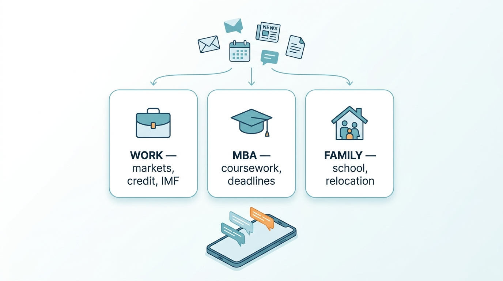
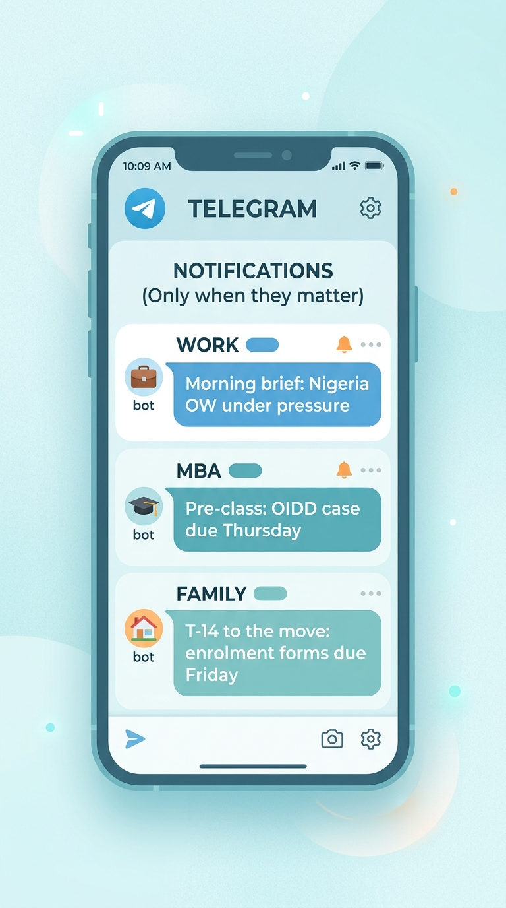
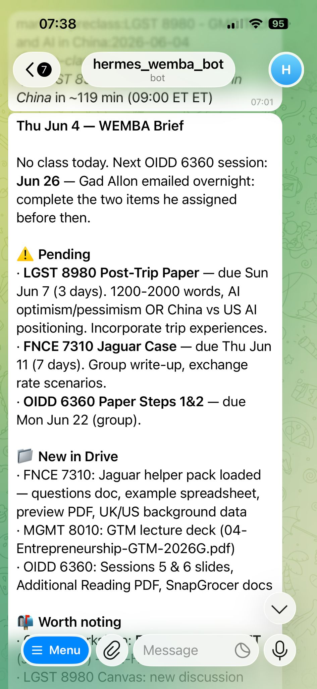

# Three AI Agents That Run My Life



> How one person uses a small fleet of always-on AI agents to handle **work**, an **MBA**, and **family logistics** — explained for people who have never touched an "agent" before.

I'm an emerging-markets fixed-income portfolio manager, a part-time Wharton EMBA student, and a dad relocating a family across the world. Three different lives, three different streams of email/calendars/documents/news, and not enough hours.

So I built three AI agents — one per life — that read the firehose, decide what actually matters, and message me only when something needs me. This repo explains **how they work and why**, with diagrams and (sanitized) real code.

It is deliberately written for a **non-technical reader**. If you've heard "AI agents" and thought *"...okay but what does that actually mean in practice?"* — this is for you.

---

## The one-paragraph version

Each agent ("lane") is a long-running program that wakes up on a schedule, gathers information from my email/calendar/documents/news feeds, runs it through a large language model (the same kind of AI behind ChatGPT/Claude) with a **specific job description and memory**, and then sends me a short, human Telegram message. It does this on its own, ~30 times a day, across three separate "lanes" so my work brain, school brain, and family brain never bleed into each other.

```
   📨 emails        📅 calendars       📰 news/RSS        📑 documents
        \                |                  |                /
         \               |                  |               /
          ▼              ▼                  ▼              ▼
   ┌─────────────────────────────────────────────────────────────┐
   │                  THREE AI AGENT "LANES"                       │
   │                                                               │
   │   💼 WORK (em)        🎓 MBA (wemba)        👨‍👩‍👧 FAMILY        │
   │   markets, credit,    course prep,          school, relocation,│
   │   IMF, ratings        deliverables          calendar           │
   └─────────────────────────────────────────────────────────────┘
                              │
                              ▼
                  📱 short Telegram messages — only when it matters
```

---

## Why three separate agents instead of one?

Because **context is everything**, and mixing it makes the AI worse at all three jobs.

- My **work** agent knows it's a sovereign-credit PM. It cares about Egypt's IMF program and Brazilian rates. It should *never* surface my daughter's school newsletter.
- My **MBA** agent knows my Wharton courses and deliverables. It links a podcast on startup unit-economics to my entrepreneurship class.
- My **family** agent knows we're relocating, knows the kids' schools, and counts down to move-day. It should never page me about bond spreads.

Same underlying AI, three different **"job descriptions" + memories + data sources**. That separation is the whole trick.

| Lane | Role | Watches | Example output |
|------|------|---------|----------------|
| 💼 **Work** (`em`) | EM sovereign-credit chief-of-staff | Bloomberg, IMF, rating agencies, EM podcasts, prediction markets | "Morning brief: Nigeria OW under pressure — Brent <$90; S&P upgraded SA outlook." |
| 🎓 **MBA** (`wemba`) | EMBA study partner | Google Drive coursework, Wharton email, class calendar | "Pre-class brief: OIDD 6360 case due Thu; a podcast this week maps to your scaling-ops paper." |
| 👨‍👩‍👧 **Family** (`family`) | Household logistics assistant | School emails, relocation tasks, family calendar | "T-14 to the move. Patricia (school) sent enrolment forms — due Friday." |

Everything reaches me the same way: **three separate Telegram bots**, one per lane — and only when something's worth my attention.



### See it in action

> 📸 *Real (redacted) screenshots of the bots in daily use live in [`images/screenshots/`](images/screenshots/).*

<!-- Once added, embed them here, e.g.:
| Work bot — morning brief | MBA bot — pre-class | Family bot — relocation nudge |
|---|---|---|
|  |  |  |
-->


---

## What's in this repo

| File | What it shows |
|------|---------------|
| [`docs/01-what-is-an-agent.md`](docs/01-what-is-an-agent.md) | Plain-English: what an "agent" actually is, vs. a chatbot |
| [`docs/02-architecture.md`](docs/02-architecture.md) | The full system, with diagrams |
| [`docs/03-the-digest-pipeline.md`](docs/03-the-digest-pipeline.md) | A worked example: how the podcast digest turns 20 hours of audio into a 2-minute read |
| [`docs/04-memory.md`](docs/04-memory.md) | How the agents *remember* things across days |
| [`docs/05-design-principles.md`](docs/05-design-principles.md) | The hard-won rules (cost control, "only ping me when it matters", failure handling) |
| [`docs/06-the-schedule.md`](docs/06-the-schedule.md) | **Every scheduled job (all ~35), how they connect, and how Telegram delivery works** |
| [`docs/07-how-i-built-this.md`](docs/07-how-i-built-this.md) | The honest build story — stack, what took the time, and advice if you want to try |
| [`docs/08-the-fleet-map.md`](docs/08-the-fleet-map.md) | **One master diagram: all ~35 jobs, every connection, and exactly which ones ping Telegram** |
| [`docs/09-the-ops-lane.md`](docs/09-the-ops-lane.md) | **The fleet that watches the fleet: a command-centre readiness board, an hourly self-healing watchdog, and an "on-call SRE" ops bot** |
| [`examples/`](examples/) | Sanitized excerpts of the real code |
| [`images/`](images/) | Rendered workflow visuals |

---

## The honest disclaimers

- **This is a personal setup, not a product.** It's shared to *explain a way of working*, not as something to clone-and-run. Secrets, tokens, and personal data have been removed.
- **It costs real (small) money.** The agents call commercial AI APIs. A core design goal was keeping that to a few dollars a month (see [design principles](docs/05-design-principles.md)).
- **The AI is a junior assistant, not an oracle.** It triages and drafts; I decide. Every design choice assumes it will sometimes be wrong.

---

## The tech, named (for the curious)

Built on [Hermes Agent](https://hermes-agent.nousresearch.com) (an open agent runtime), reachable over Telegram, with a local memory service, scheduled jobs ("crons"), and a mix of language models routed by cost/quality (Claude, DeepSeek, Gemini). Everything runs on one small cloud server. You do **not** need to know any of that to read the docs above — they start from zero.

*Questions? This was built and documented collaboratively with Claude (Anthropic). The architecture is real and in daily use.*
