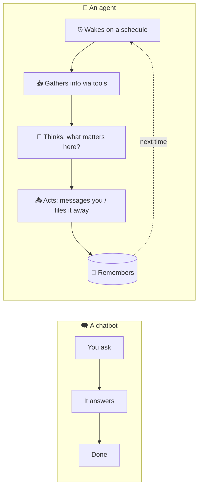

# 1 · What is an "AI agent," really?

If you've used ChatGPT, you've used an AI **chatbot**: you type, it replies, the conversation ends when you close the tab. It only ever does something when *you* poke it.

An **agent** is the same underlying AI, but wrapped in three things that make it act on its own:

1. **A schedule**: it wakes itself up (e.g. every morning at 6am, every 30 minutes) without you asking.
2. **Tools**: it can *do* things: read your email, search the web, fetch a document, send you a message.
3. **A standing job description + memory**: it always knows who it's working for, what it's responsible for, and what happened yesterday.

## The mental model: a junior team member

The most useful way to think about each agent is as a **diligent junior assistant** who:

- has a narrow, clear remit ("you watch my work inbox and the bond markets"),
- works a defined shift ("check at 6am, 10am, and end of day"),
- knows when to interrupt me ("only message me if something is actually time-sensitive"),
- keeps notes so they're not starting from scratch each day,
- and is **occasionally wrong**, so I review their work and don't blindly trust it.

That last point drives a lot of the design. The agent's job isn't to *decide*; it's to **triage and draft** so that by the time something reaches me, 90% of the noise is gone and what's left is framed for a fast human decision.

## Why "large language model" matters here

The "thinking" step uses a **large language model (LLM)**: the technology behind ChatGPT and Claude. What makes it powerful for this use case isn't that it *knows* things; it's that it can **read messy human text and judge relevance**:

- "Is this Bloomberg alert actually market-moving, or routine?"
- "Does this school email need action, or is it an FYI?"
- "Three podcasts said the same thing about Iran oil, is that a real signal?"

A traditional program can't make those judgment calls. An LLM can, imperfectly, but well enough that, filtered through good design, it saves hours.

## So what's an "agent fleet"?

Just **several agents running at once**, each with a different job description. In my case, three, one for work, one for my MBA, one for family. They share the same machine and the same underlying AI, but they never share *context*. That separation is the subject of the [next doc](02-architecture.md).

---
**Next:** [02 · The architecture →](02-architecture.md)
