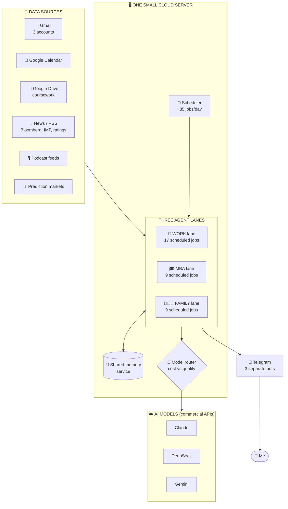
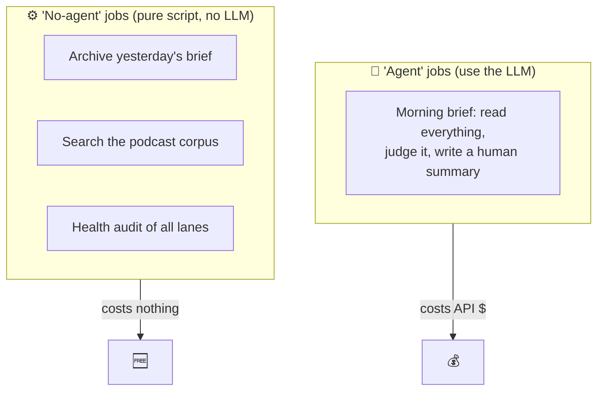
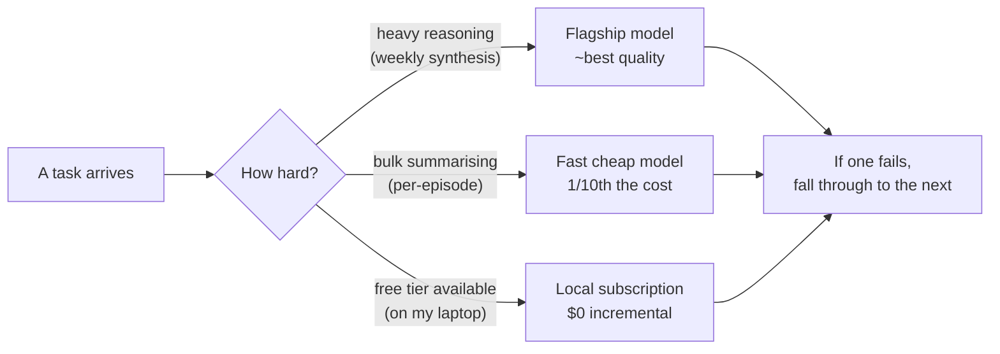
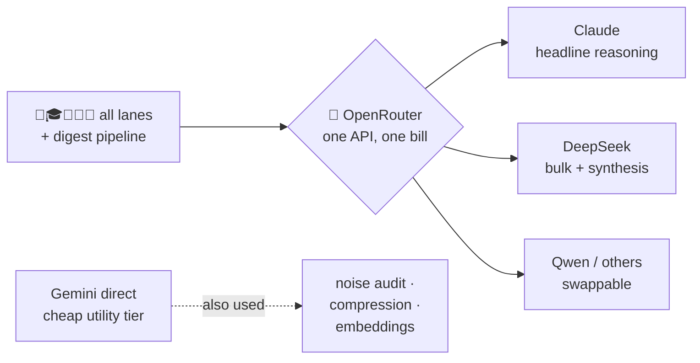
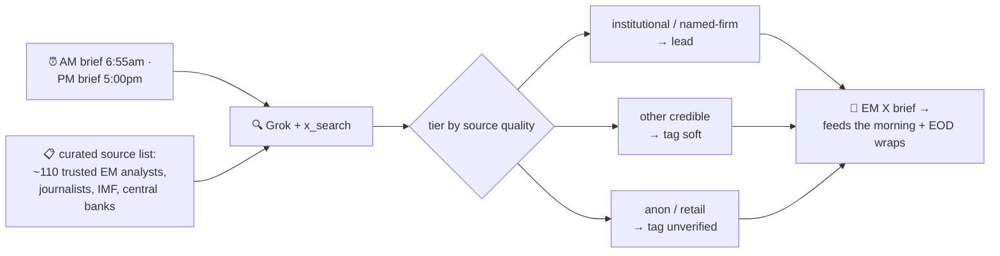

# 2 · The architecture

Everything runs on **one small cloud server** (a $5/month VPS). On it live three independent agent "lanes," a shared memory service, and a scheduler. Each lane talks to me through its own Telegram bot.

## The big picture

## What each lane is made of

Every lane is the same machinery with different settings:

- **SOUL.md** — a plain-text "constitution" telling the AI who it is and how to behave (tone, hard rules, what never to do). This is where the three lanes diverge most.
- **jobs.json** — the cron schedule: which task fires when.
- **helper scripts** — small deterministic programs (no AI) that gather or post data, so the AI only does the *judgment*, not the plumbing.
- **bot + model config** — which Telegram bot it speaks through, and which AI models it's allowed to use.

## Two kinds of scheduled job

A subtle but important distinction that keeps costs down:

If a task can be done by deterministic code, it runs as a **no-agent** job — zero AI cost. The LLM is reserved for the genuinely hard part: *reading messy input and deciding what matters.* (This wasn't the original design — see the [cautionary tale in design principles](05-design-principles.md) about a job that was needlessly burning the AI ~48 times a day.)

## The model router

No single AI model is best for everything, so each lane routes work by **cost vs. quality**:

This "try the cheap/free option first, fall back to the premium one only if needed" pattern is everywhere in the system. It's the difference between a fun side-project and a $300/month habit.

### One gateway, many models: OpenRouter

A practical problem: I want to use the *best model for each job* — Claude for some things, DeepSeek for others, Gemini for the cheap utility work — but I don't want five separate API accounts, five billing relationships, and five different bits of code.

The fix is [**OpenRouter**](https://openrouter.ai): a single API that sits in front of dozens of providers. I send every request to one endpoint with a model name like `anthropic/claude-...` or `deepseek/deepseek-...`, and OpenRouter routes it, bills it centrally, and lets me **swap models by changing a string** — no code change.

Two things this unlocks:
- **Model choice is configuration, not code.** Each task has an env-overridable model name. When DeepSeek's flagship flaked one night and returned empty responses, switching that stage to its faster sibling was a one-line change — and I'd already wired it as an automatic fallback, so it self-healed.
- **Per-task routing.** Heavy reasoning → a flagship; bulk per-item work → a fast cheap model; throwaway utility judgments → the cheapest thing available.

### Who does what (the actual roster)

| Job | Model tier | Why |
|-----|-----------|-----|
| Morning/EOD briefs, weekly synthesis | **Flagship** (Claude / DeepSeek-pro), via OpenRouter | Hard reasoning, worth the cost |
| **Live X/Twitter market scan** (AM + PM briefs) | **Grok** w/ native `x_search` tool | Real-time read of what credible EM analysts/journalists are posting *right now* |
| Per-episode podcast summaries | **Fast cheap** (DeepSeek-flash), via OpenRouter | High volume, doesn't need a flagship |
| **Noise classification** (nightly lane audits) | **Fast cheap** (DeepSeek-flash), via OpenRouter | Thousands of tiny "signal or noise?" calls — cheap, and one fewer provider to manage |
| Free tier (on my laptop) | **Local subscription CLI** | $0 incremental — tried *first* where available |
| **Context compression** | **Gemini Flash-Lite** (direct) | Squashing long histories cheaply |
| **Embeddings** (podcast clustering) | **Gemini embeddings** (direct) | Cheap vector maths, not text generation |

> **A note on consolidation:** these things *can* run on any cheap model, and I've moved them around. The nightly noise-audit cron originally used Gemini Flash-Lite; I later pointed it at DeepSeek-flash (via OpenRouter) to keep the whole text-generation side on **one provider and one key** — simpler to reason about and bill. Gemini still earns its place for **embeddings** (vector maths, not text — a different job) and conversation **compression**. The lesson isn't "Gemini vs DeepSeek"; it's that *because* model choice is just a config string ([OpenRouter](#one-gateway-many-models-openrouter)), consolidating or swapping the cheap-utility tier is a one-line change, not a rewrite.

### Why a different model for X/Twitter

The work bot's morning and evening market briefs lead with **what credible people are saying on X right now** — rating-agency actions, IMF news, analyst takes on specific emerging-market credits. No general model can do that: it needs *live* access to X.

The answer is **Grok** (xAI's model), which has a native `x_search` tool — it can actually query X and read recent posts. So this one job routes to Grok instead of the usual models. Two design touches make it useful rather than noisy:

1. **A curated prior** — a list of ~110 reputable accounts (EM economists, sovereign-debt journalists, the IMF/World Bank/central banks). Grok is told to prioritise and cite these, and to flag anything from an unknown account as `[unverified]`.
2. **Tiered surfacing** — posts are ranked by source credibility, so a Brad Setser thread leads and an anonymous hot-take is labelled and demoted, never silently dropped.

The result is saved to a rolling snapshot file that the end-of-day wrap reads — so the market brief and the EOD summary stay consistent. *(Hard-won detail: the evening window is thinner than the morning, so the PM brief needs explicit instructions to surface the best of what it finds rather than declaring the session "quiet" — otherwise a strict model reports nothing even when there are usable posts.)*

---
**Next:** [03 · A worked example: the podcast digest →](03-the-digest-pipeline.md)
