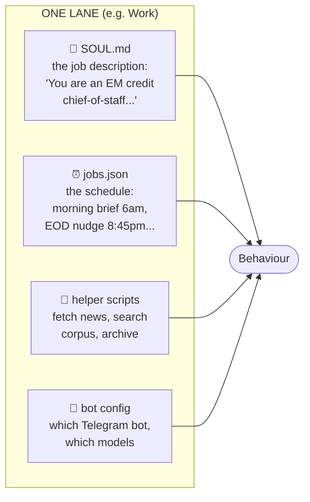
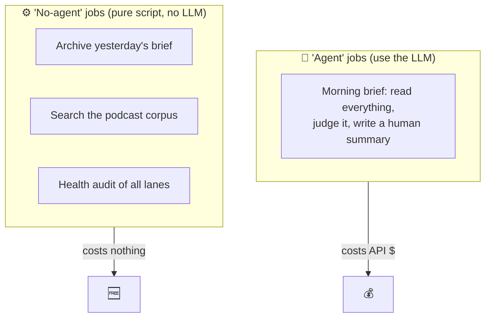
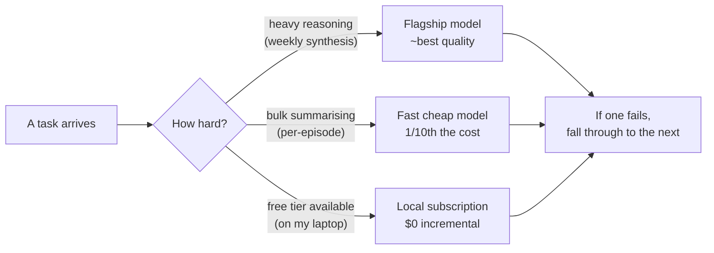

# 2 · The architecture

Everything runs on **one small cloud server** (a $5/month VPS). On it live three independent agent "lanes," a shared memory service, and a scheduler. Each lane talks to me through its own Telegram bot.

## The big picture

## What each lane is made of

Every lane is the same machinery with different settings:

- **SOUL.md** — a plain-text "constitution" telling the AI who it is and how to behave (tone, hard rules, what never to do). This is where the three lanes diverge most.
- **jobs.json** — the cron schedule: which task fires when.
- **helper scripts** — small deterministic programs (no AI) that gather or post data, so the AI only does the *judgment*, not the plumbing.
- **bot + model config** — which Telegram bot it speaks through, and which AI models it's allowed to use.

## Two kinds of scheduled job

A subtle but important distinction that keeps costs down:

If a task can be done by deterministic code, it runs as a **no-agent** job — zero AI cost. The LLM is reserved for the genuinely hard part: *reading messy input and deciding what matters.* (This wasn't the original design — see the [cautionary tale in design principles](05-design-principles.md) about a job that was needlessly burning the AI ~48 times a day.)

## The model router

No single AI model is best for everything, so each lane routes work by **cost vs. quality**:

This "try the cheap/free option first, fall back to the premium one only if needed" pattern is everywhere in the system. It's the difference between a fun side-project and a $300/month habit.

---
**Next:** [03 · A worked example: the podcast digest →](03-the-digest-pipeline.md)
