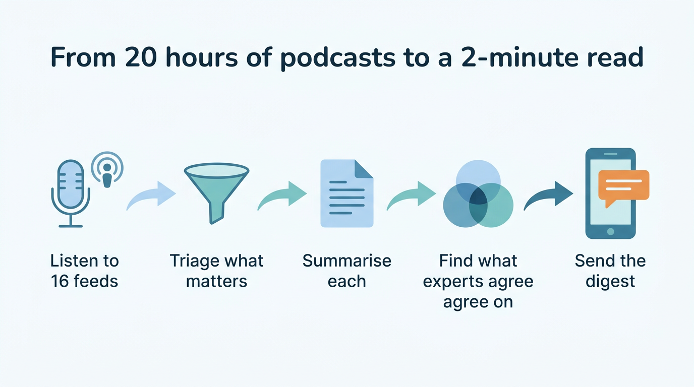
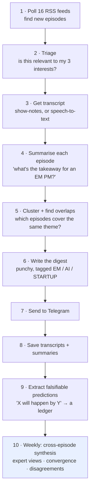
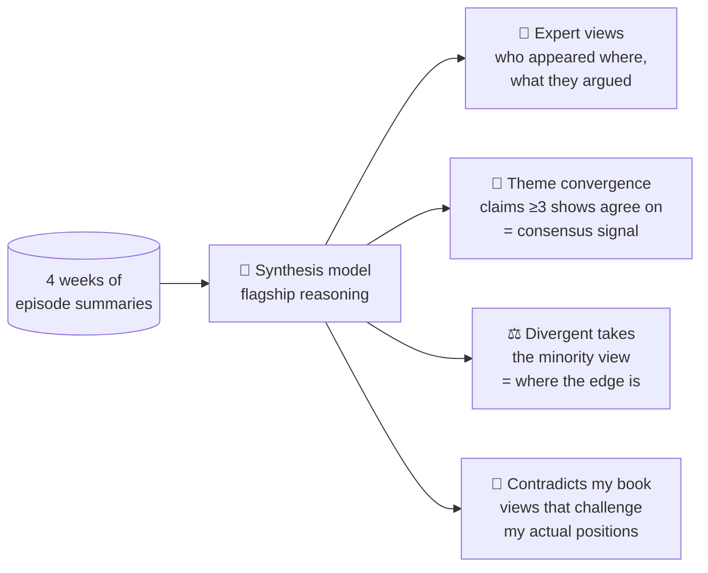
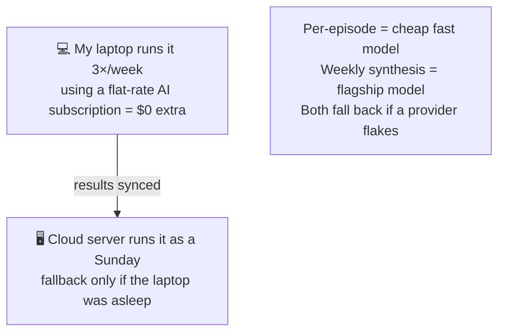

# 3 · A worked example: the podcast digest

This is my favourite agent because it's the easiest to *feel* the value of. I follow ~16 podcasts across emerging-markets macro, AI-in-finance, and startups. That's **20+ hours of audio a week** I have no chance of listening to.

The digest agent turns that into a 2-minute read, and, once a week, a cross-episode "what are the smart people converging on?" synthesis.



## The pipeline, stage by stage



## What stage 4 actually produces (per episode)

Each episode becomes a structured note, not a wall of text, but fields I can scan:

- **Summary** (≤200 words, leading with the most relevant angle)
- **Takeaways** (3-5 bullets)
- **Countries mentioned** (so I can search "what did the corpus say about Egypt?")
- **Listen verdict**: LISTEN / SKIM / SKIP, with a one-line reason
- **Pillar**: is this an EM, AI-in-finance, or startup episode?
- For startup/AI episodes, **does it connect to one of my MBA courses?** (this is the bridge to the school agent)

## Stage 10: the part that's genuinely hard for a human

Listening to one podcast is easy. Noticing that **three different experts on three different shows independently made the same call**: *that's* the alpha, and it's exactly what a human drowning in content misses.



That last output, *"here are the podcast views that directly contradict the positions you hold"*, is deliberately uncomfortable, and the most useful thing the whole system does.

## The cost trick on this pipeline

The heavy stages (summarise, synthesise) use AI, so they're the expensive part. Two design moves keep it cheap:



So the bulk work happens on a machine where AI is effectively free, and the cloud server only steps in as a safety net. Net cost: cents per week.

## Asking the corpus questions

Because every episode is summarised and stored in [memory](04-memory.md), I can just message the work bot:

```
/podcast_q oil Iran Hormuz
→ [EXPERT] Javier Blas: current oil rally is a Middle-East risk
  premium, not a supply shock, fades absent real disruption...
  on: Odd Lots (2026-05-18)
```

No AI call, no waiting, it's a plain keyword search over the stored corpus. Fast and free.

---
**Next:** [04 · How the agents remember →](04-memory.md)
