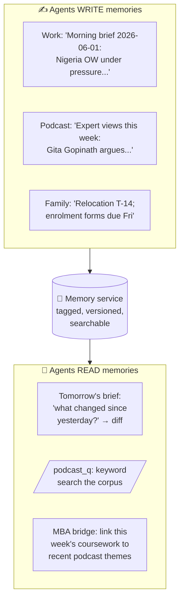
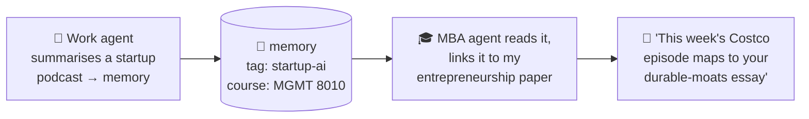

# 4 · How the agents remember

A chatbot forgets everything when you close the tab. An agent that's supposed to act like a junior colleague **cannot** forget, it needs to know what it told me yesterday, what I marked as done, and what's already been flagged as noise.

So the fleet has a shared **memory service** running on the same server. Think of it as a notebook every lane can write to and read from.

## Three things memory unlocks

**1. "What changed since yesterday?"**
The morning brief doesn't just re-dump the state of the world, it reads yesterday's brief from memory and leads with the **diff**: what's *new*. That's the difference between a useful briefing and noise.

**2. Cross-agent connections**
This is the elegant bit. The **work** agent's podcast digest writes its insights to memory tagged by topic. The **MBA** agent, on a different schedule, reads those memories and asks: *"does anything my classmates and I are studying this week show up in Nick's podcast corpus?"*

Two agents, different jobs, different schedules, collaborating through shared memory without ever talking directly. That's a genuinely agentic pattern, and it falls out naturally once memory is shared.

**3. Learning what's noise**
When something gets flagged but turns out to be irrelevant, that judgment is remembered, so the same non-event doesn't page me again next week.

## Wait, doesn't "shared memory" contradict "lanes never bleed"?

Fair question, it's the one sharp readers always ask. The answer is that **sharing is narrow and deliberate**: lanes share *derived, tagged insights*, never their raw inputs, credentials, or personalities. Here's the exact boundary:

| State | Shared between lanes? | How it's controlled |
|-------|----------------------|---------------------|
| Persona / job description (SOUL) | ❌ Never | One per lane; the family agent literally doesn't know what a bond spread is |
| Credentials (email, calendar, Drive) | ❌ Never | Separate accounts and scopes per lane |
| Raw inputs (emails, documents, feeds) | ❌ Never | Stay lane-local; other lanes can't read them |
| Derived insights (podcast themes, course topics, brief archives) | ✅ Selectively | Written to the memory service **tagged by topic**; a lane reads only the tags relevant to its job |
| Operational health (job status, errors, feed ages) | ✅ Read-only | The ops lane reads every lane's ledgers, but never their content |

So when the MBA lane "reads the work lane's podcast insights", it's reading a short, tagged summary the work lane *chose to publish* into memory, not the work lane's inbox. The raw firehose never crosses a lane boundary; only conclusions do.

## Why a dedicated service (not just files)?

Early versions wrote notes to plain text files synced between machines. It worked until it didn't, two processes writing at once would corrupt things. A proper memory service handles **versioning** (a memory can be superseded by a newer version) and **concurrent access** safely. The lesson: as soon as multiple agents share state, treat that state like a real database, not a scratchpad.

---
**Next:** [05 · Design principles (the hard-won rules) →](05-design-principles.md)
