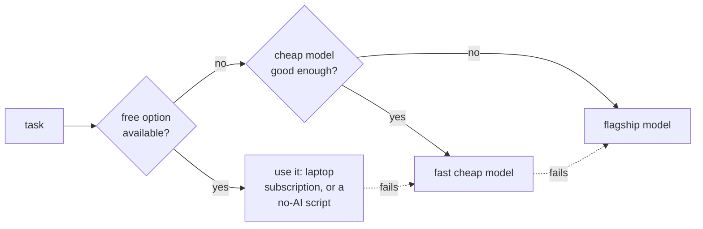
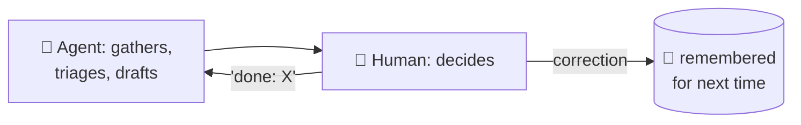

# 5 · Design principles (the hard-won rules)

Everything above is the happy path. These are the rules I learned the *expensive* way, they're what separate an agent fleet that helps from one that spams you, breaks, or quietly drains your wallet.

## 1. Only ping me when it actually matters

The default failure mode of an eager AI assistant is **noise**. An agent that messages you 40 times a day gets muted in a week. So:

- Every lane has a "quiet by default" posture: if a scheduled check finds nothing worth saying, it sends **nothing** (`empty output = silent`).
- A nightly "noise audit" reviews what was sent and learns which categories were non-events.
- Briefs lead with *what changed*, not a re-statement of everything.

> **The bar:** would a sharp human chief-of-staff actually interrupt me for this? If not, stay quiet.

## 2. Cheap by default, premium only when needed



- Tasks that don't need AI run as **no-agent scripts** (zero cost).
- Bulk work uses a **fast cheap model**; only genuinely hard reasoning gets the **flagship**.
- A flat-rate subscription on my laptop does the heavy lifting where possible ($0 incremental).

**The cautionary tale:** one job was set up to use the LLM and fire every 30 minutes, ~48 AI calls a day, ~95% of which produced "nothing to report." It was quietly costing ~$15/month and bloating the database, for almost no value. Converting it to a deterministic no-agent gate (only invoke the AI when a cheap pre-check says there's something there) eliminated the cost. **Audit what your agents actually do, not what you think they do.**

## 3. Assume every model call can fail, and chain fallbacks

Commercial AI APIs flake: timeouts, rate limits, occasionally an empty response after 4 minutes. A weekly job that simply dies on a bad night is useless. So critical pipelines have a **fallback chain**:

```
free local model  →  flagship model  →  fast model  →  (give up gracefully)
```

If one tier fails, the next takes over. And there's a **circuit breaker**: if the free local model fails once in a run, the whole run stops retrying it and jumps to the API, so one bad component can't make every step time out.

## 4. One bad item shouldn't sink the whole job

A real bug from this build: the weekly synthesis asks the AI for structured data (expert views, themes, each needing a citation). One time, the AI returned 30 perfect items and **1** that was missing its citation. The validator rejected the *entire* synthesis over that one item, a whole week's analysis lost.

The fix: **sanitize, don't reject.** Drop the one malformed item, keep the 30 good ones. Be strict about quality, but degrade gracefully.

## 5. Separate contexts, ruthlessly

The three lanes never share a "brain." My family agent has no idea what a bond spread is, and that's a feature, it means it can't accidentally surface work content, and its judgment about *family* matters isn't diluted. Shared **memory** is fine (it's tagged and scoped); shared **context/persona** is not.

## 6. The human is the backstop, always



The agent never executes irreversible actions on my behalf. It prepares; I decide. When I reply "done: X" or correct it, that feeds back into memory. The system is designed around the assumption that the AI is a capable but fallible junior, never the final authority.

## 7. Make it observable

With ~35 jobs a day across three lanes, things *will* break silently. A daily "health audit" checks every lane (are the bots alive? did the crons run? are the data feeds fresh? are the API keys valid?) and reports a readiness summary. You can't fix what you can't see.

---

## The meta-lesson

None of the value is in the AI being clever. It's in the **plumbing around** the AI: the schedule, the cost routing, the fallbacks, the memory, the "stay quiet unless it matters" discipline, and the relentless assumption that the model will sometimes be wrong. Get that right and a fairly ordinary AI model becomes a genuinely useful assistant. Get it wrong and even the smartest model becomes expensive noise.

---
**Next:** [06 · The schedule: every job, and how they connect →](06-the-schedule.md)

**Back to:** [README](../README.md) · [Architecture](02-architecture.md) · [Code examples](../examples/)
