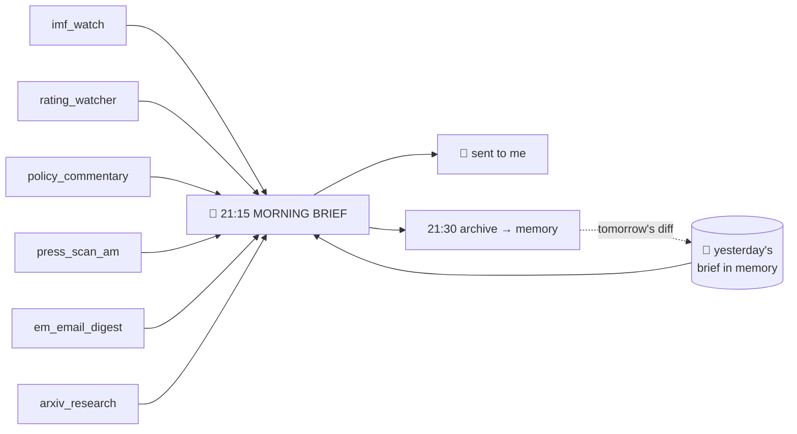
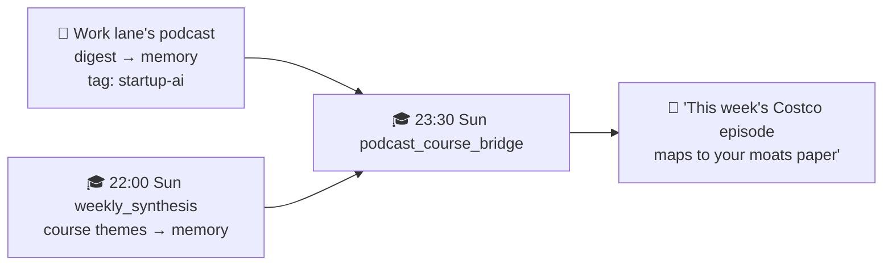
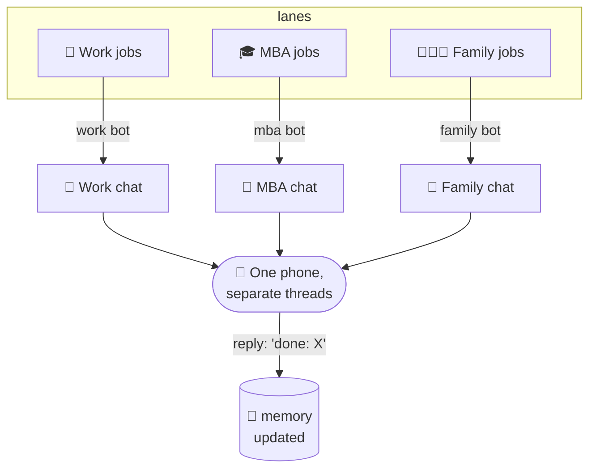
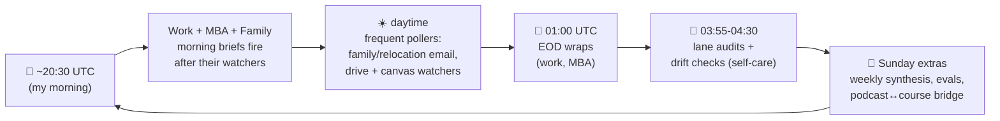

# 6 · The schedule: every job, and how they connect

This is the part people find most surprising: there's no "AI deciding what to do next." The fleet runs on a **boring, deterministic schedule**: about **60 jobs a day** across four lanes (three content lanes, plus an ops lane that watches the other three). Each job has a fixed time, a fixed task, and a fixed delivery target. The intelligence is *inside* each job; the orchestration is just a clock.

Two kinds of job (recap from [architecture](02-architecture.md)):
- 🧠 **agent** job, invokes the AI to read + judge + write.
- ⚙️ **no-agent** job, a script (deterministic, or a single cheap model call for formatting). Most jobs are these.

And three **delivery targets**:
- 📱 `telegram`, sends me a message on that lane's bot.
- 🔄 `origin`, delivers to that lane's own channel *when the job has something to say* (so the daily briefs surface, but a watcher that found nothing stays quiet).
- 🗃️ `local`, writes data/files other jobs consume; I'm never pinged.

> All times below are **UTC**. My local morning is ~20:30 UTC, so the morning cluster of jobs fires ~20:20-21:50 UTC and the evening/EOD wraps land after 01:00 UTC.

---

## 💼 WORK lane (`em`), 21 jobs

The busiest lane. Notice the **pattern**: cheap no-agent "watcher" scripts run *first* and write data locally; then the AI morning brief runs and reads everything they gathered.

| Time (UTC) | Job | Type | Delivers | What it does |
|-----------|-----|------|----------|--------------|
| 20:20 | `imf_watch` | ⚙️ | local | IMF program news → file |
| 20:30 | `policy_commentary` | ⚙️ | local | Think-tank / policy RSS → file |
| 20:30 | `arxiv_research` | ⚙️ | local | Scans new research papers (arXiv/OpenAlex) → file |
| 20:30 (Sun/Wed) | `podcast_weekly_synthesis` | 🧠 | 📱 | Cross-episode podcast synthesis → a 2-min read |
| 20:40 | `press_scan_am` | ⚙️ | local | Morning financial-press scan → file |
| 20:45 | `em_email_digest` | 🧠 | 📱 | Triages the work inbox → digest |
| 20:50 | `rating_watcher` | ⚙️ | local | Rating-agency actions → file |
| 20:55 | `em_digest_publish` | ⚙️ | local | Assembles the day's digest → feed |
| 21:00 | `kanban_digest` | ⚙️ | 📱 | Digest of my task-board state |
| **21:15** | **`em_morning_brief`** | 🧠 | 📱 | **Reads ALL the watchers + memory, writes the brief** |
| 21:30 | `em_brief_archive` | ⚙️ | local | Saves the brief to memory (for tomorrow's diff) |
| 21:45 | `vault_daily_snapshot` | ⚙️ | local | Snapshots the day's data vault |
| 21:50 | `agentmemory_ingest` | ⚙️ | local | Ingests the day's outputs into the memory service |
| 08:00 | `podcast_queue_sync` | ⚙️ | 📱 | Syncs the shared podcast listen-queue + my ratings |
| 10:10 | `press_scan_pm` | ⚙️ | local | Evening financial-press scan → file |
| 10:45 | `em_eod_nudge` | 🧠 | 📱 | End-of-day wrap: what moved, what needs me tomorrow |
| 01:15 | `em_eod_archive` | ⚙️ | local | Saves the EOD wrap to memory |
| 22:00 (Sat) | `news_weekly_review` | 🧠 | 📱 | Weekly review of the week's market/news coverage |
| 22:00 (Sun) | `dashboard_monitor` | ⚙️ | 📱 | Checks a personal dashboard is up and healthy |
| 03:55 | `em_lane_audit` | ⚙️ | local | Self-check: did everything run? |
| 04:30 | `skills_drift_audit` | ⚙️ | 📱 | Flags if any agent skill has gone stale |

**The connection:** a stack of cheap watchers (20:20→21:00) feed the **21:15 morning brief**, which is archived (21:30) so that *tomorrow's* brief can open with "here's what changed since yesterday." That archive is also what the diff logic and on-demand corpus queries read. One AI call a morning; everything around it is free plumbing.

---

## 🎓 MBA lane (`wemba`), 19 jobs

Mostly quiet plumbing into memory, with a cluster of AI jobs that turn coursework into study help, plus a set of guardrail checks (evals, ledger invariants, Canvas reconciliation) that keep the data honest.

| Time (UTC) | Job | Type | Delivers | What it does |
|-----------|-----|------|----------|--------------|
| every 30 min | `drive_watch` | ⚙️ | origin | Watches Google Drive for new coursework |
| every 30 min | `preclass_brief` | ⚙️ | origin | If a class is imminent, preps a brief |
| every 6h | `canvas_heartbeat` | ⚙️ | local | Checks the Canvas session/data is still fresh |
| 20:30 | `daily_wemba_brief` | 🧠 | 📱 | Daily study brief: deadlines, new materials, Wharton email |
| 20:40 | `canvas_truth` | ⚙️ | 📱 | Reconciles course data against Canvas (the source of truth) |
| 21:00 | `chief_of_staff` | 🧠 | origin | Tracks deadlines *and* follow-through (morning pass) |
| 21:00 | `assignment_reconcile` | ⚙️ | 📱 | Reconciles assignments vs. evidence they got done |
| 21:00 | `calendar_sync` | ⚙️ | origin | Keeps the class calendar in sync |
| 21:15 | `prof_email_radar` | 🧠 | origin | Scans course/professor email for what needs action |
| 09:00 | `chief_of_staff_eod` | 🧠 | origin | Chief-of-staff evening pass (catches the US day) |
| 09:00 (Mon/Thu) | `preclass_pack` | 🧠 | 📱 | Deeper pre-class prep pack before class days |
| 01:00 | `wemba_eod_nudge` | 🧠 | local | End-of-day: tomorrow's prep |
| 10:00 (Sun) | `matcher_eval` | ⚙️ | 📱 | Runs the labeled matching-eval regression suite |
| 10:30 (Sun) | `ledger_invariants` | ⚙️ | 📱 | Checks the completion-ledger invariants still hold |
| **22:00 (Sun)** | **`weekly_synthesis`** | 🧠 | origin | A model panel writes the week's citation-checked course notes |
| 22:00 (Sun) | `load_forecast` | 🧠 | origin | Forecasts the coming week's coursework load |
| 22:00 (Sun) | `canvas_cadence_report` | ⚙️ | 📱 | Weekly Canvas coverage/cadence report |
| **23:30 (Sun)** | **`podcast_course_bridge`** | ⚙️ | 📱 | **Links the week's coursework to recent podcast themes** |
| 03:55 | `wemba_lane_audit` | ⚙️ | local | Self-check |

**The cross-lane connection (the elegant bit):** the Sunday `weekly_synthesis` (22:00) writes the week's course themes to memory. Ninety minutes later, `podcast_course_bridge` (23:30) reads *both* those course themes **and** the work lane's podcast insights, finds overlaps (e.g. a startup podcast that maps to my entrepreneurship paper), and messages me. **Two lanes collaborating through shared memory**: see [memory](04-memory.md).

---

## 👨‍👩‍👧 FAMILY lane (`family`), 10 jobs

The most time-sensitive lane (school deadlines, an international move), so it polls more frequently during waking hours.

| Time (UTC) | Job | Type | Delivers | What it does |
|-----------|-----|------|----------|--------------|
| :00,:30 (waking hrs) | `family_imminent` | ⚙️ | 📱 | Imminent family-calendar events → pings |
| :15 (waking hrs) | `relocation_emails` | ⚙️ | 📱 | Relocation-related email → pings |
| 20:00 | `chief_of_staff` | 🧠 | local | Pulls tasks + checks follow-through (before the brief) |
| 20:30 | `daily_family_brief` | 🧠 | 📱 | Morning family brief: today's events + actions |
| 20:45 | `family_brief_archive` | ⚙️ | local | Saves the brief to memory |
| 21:00 | `family_advisor` | 🧠 | 📱 | Proactive advisor pass: guidance + flags across the household |
| 21:15 | `rental_email_alerts` | ⚙️ | 📱 | New rental listings/alerts in the destination city |
| 20:30 (Sun) | `family_insights_digest` | ⚙️ | 📱 | Weekly digest of what the lane has learned |
| 21:30 (Sun) | `relocation_sweep` | ⚙️ | 📱 | Weekly relocation-checklist sweep |
| 03:55 | `family_lane_audit` | ⚙️ | local | Self-check |

**The connection:** the daily brief (20:30) gives the calm overview, preceded by a chief-of-staff pass (20:00) that reconciles the task ledger first; the frequent pollers (`family_imminent`, `relocation_emails`) handle anything urgent *between* briefs, and `family_advisor` adds a proactive nudge. The closer we get to move-day, the louder the relocation jobs are allowed to be.

---

## 🛟 OPS lane (`ops`), 12 jobs

The fourth, supervisory lane. It produces no "content"; it watches the other three and keeps the fleet honest. It gets its own chapter, [09 · The ops lane](09-the-ops-lane.md), but here it is on the same clock:

| Time (UTC) | Job | Type | Delivers | What it does |
|-----------|-----|------|----------|--------------|
| hourly | `self_heal_watchdog` | ⚙️ | 📱 | Fixes safe/reversible failures on its own, escalates the rest |
| every 30 min | `remediation_triage` | ⚙️ | local | Triages any errored jobs across all lanes |
| every 6h | `observer_digest` | ⚙️ | 📱 | Rolling digest of fleet activity |
| 08:00, 20:00 | `fleet_health` | ⚙️ | 📱 | The twice-daily readiness board (SITREP) |
| 19:45 | `remediation_brain_shadow` | 🧠 | local | Shadow-mode "brain": drafts fixes, changes nothing |
| 20:05 | `remediation_propose` | ⚙️ | 📱 | Surfaces the drafted fixes for my approval |
| 20:15 | `cost_tracker` | ⚙️ | 📱 | Tracks daily model/API spend |
| 20:35 | `morning_ops_digest` | ⚙️ | 📱 | Overnight fleet status, before the content briefs |
| 14:45 | `starmap_bridge` | ⚙️ | local | Bridges the fleet skill-graph into memory |
| 20:45 (Sun) | `agentmemory_insights_digest` | ⚙️ | 📱 | Weekly digest of memory-service insights |
| 14:00 (Sun) | `bak_rotation` | ⚙️ | 📱 | Rotates backups |
| 20:00 (Mon) | `model_price_watch` | ⚙️ | 📱 | Weekly watch on model prices/availability |

**The connection:** `remediation_brain_shadow` (19:45) drafts proposed fixes, `remediation_propose` (20:05) surfaces them for a yes/no, and `morning_ops_digest` (20:35) lands the overnight verdict *before* the content briefs fire, so if the fleet broke overnight, I know before I read anything it produced.

---

## How it all delivers: Telegram bots, one per lane

Every "📱" above lands in Telegram, but through **separate bots**, one per lane, so my phone shows distinct conversations (see the screenshot in the [README](../README.md)). The three content bots (work / MBA / family) carry the substance; the fourth, ops bot stays quiet unless the fleet itself needs me (see [09 · The ops lane](09-the-ops-lane.md)).

Two things make this pleasant rather than spammy:
1. **Separate threads** keep work/school/family mentally separate, I can mute one without losing the others.
2. **It's a two-way channel.** I reply `done: <thing>` and the relevant agent marks it complete in memory; I correct it and that's remembered. The bots aren't just broadcasting, they're a conversation. And I can *ask* on demand: a corpus query returns instantly, no scheduled job needed.

---

## The whole day on one clock

Roughly: **morning = brief me**, **daytime = catch anything urgent**, **evening = wrap up**, **night = the fleet checks its own health**, **Sunday = the deeper weekly thinking**. Same loop every day, ~60 jobs, one small server, a few dollars a month.

---

> 🗺️ **Want it all in one picture?** See [08 · The fleet map](08-the-fleet-map.md), every job above, every connection, and which ones ping Telegram, on a single page.

---
**Next:** [07 · How I built this →](07-how-i-built-this.md)

**Back to:** [README](../README.md) · [Architecture](02-architecture.md) · [Memory](04-memory.md) · [Design principles](05-design-principles.md) · [Fleet map](08-the-fleet-map.md)
