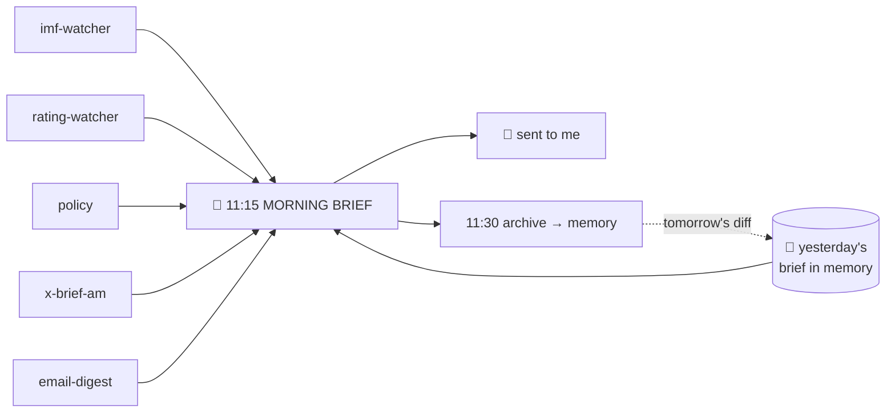
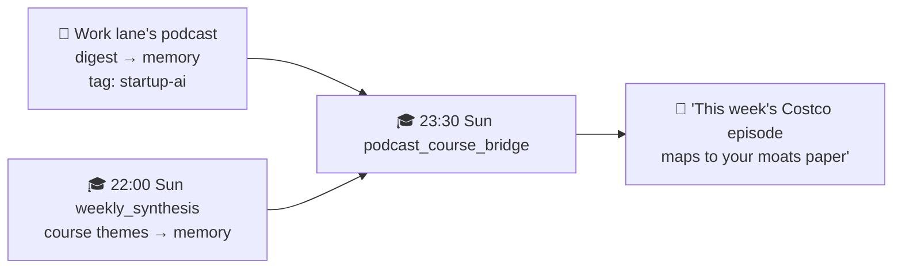
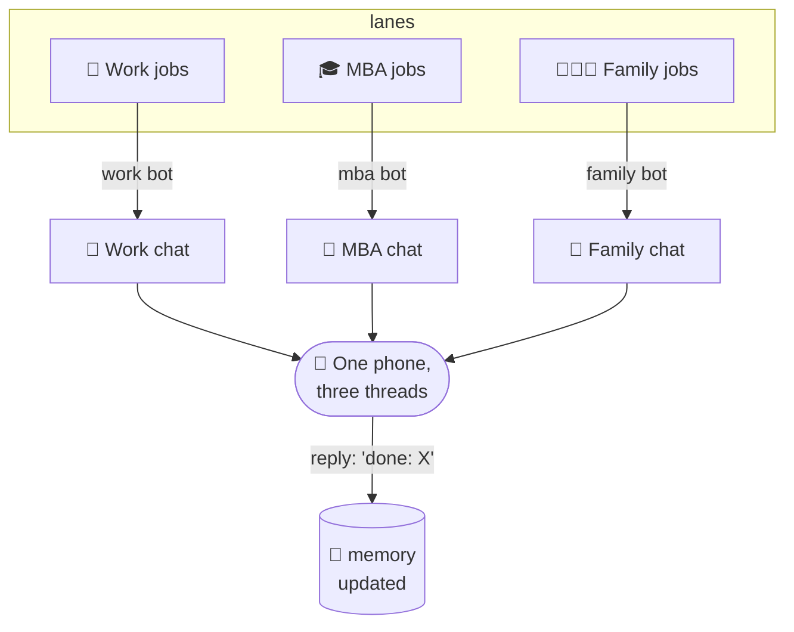
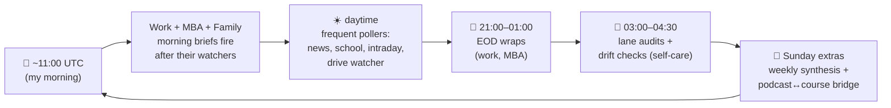

# 6 · The schedule: every job, and how they connect

This is the part people find most surprising: there's no "AI deciding what to do next." The fleet runs on a **boring, deterministic schedule** — about **35 jobs a day** across the three lanes. Each job has a fixed time, a fixed task, and a fixed delivery target. The intelligence is *inside* each job; the orchestration is just a clock.

Two kinds of job (recap from [architecture](02-architecture.md)):
- 🧠 **agent** job — invokes the AI to read + judge + write.
- ⚙️ **no-agent** job — pure script, no AI, zero cost. Most jobs are these.

And three **delivery targets**:
- 📱 `telegram` — sends me a message on that lane's bot.
- 🔄 `origin`/`local` — produces data/files other jobs consume; I'm not pinged.

> All times below are **UTC**. My morning is ~11:00 UTC (≈ 6–7am US Eastern).

---

## 💼 WORK lane (`em`) — 17 jobs

The busiest lane. Notice the **pattern**: cheap no-agent "watcher" scripts run *first* and write data locally; then the AI morning brief runs and reads everything they gathered.

| Time (UTC) | Job | Type | Delivers | What it does |
|-----------|-----|------|----------|--------------|
| 10:10 (Sun/Wed) | `imf-watcher` | ⚙️ | local | Scrapes IMF program news → file |
| 10:30 | `policy-commentary` | ⚙️ | local | Think-tank / policy RSS → file |
| 10:45 | `em_email_digest` | 🧠 | local | Triages the work inbox → file |
| 10:50 | `rating-watcher` | ⚙️ | local | Rating-agency actions → file |
| 10:55 | `x-brief-am` | ⚙️ | local | Morning EM chatter from X → file |
| **11:15** | **`em-morning-brief`** | 🧠 | 📱 | **Reads ALL the above + memory, writes the brief** |
| 11:30 | `em_brief_archive` | ⚙️ | local | Saves the brief to memory (for tomorrow's diff) |
| 11:32 | `em_position_log` | ⚙️ | local | Snapshots my positions → memory |
| 11:00, 21:00 | `polymarket_snapshot` | ⚙️ | local | Prediction-market odds → file |
| 11–23 (every 2h, Mon–Fri) | `em_news_triage` | ⚙️ | 📱 | Bloomberg alerts → only pings if market-moving |
| 16:00, 20:00 (Mon–Fri) | `x-intraday-alerter` | ⚙️ | 📱 | Intraday X signal → pings if notable |
| 21:00 | `x-brief-pm` | ⚙️ | local | Evening EM chatter → file |
| 22:00 (Mon–Fri) | `em_after_action_audit` | ⚙️ | local | Reviews the day's calls vs. outcomes |
| 00:45 | `em_eod_nudge` | 🧠 | 📱 | End-of-day wrap: what moved, what needs me tomorrow |
| 01:15 | `em_eod_archive` | ⚙️ | local | Saves the EOD wrap to memory |
| 03:55 | `em_lane_audit` | ⚙️ | local | Self-check: did everything run? |
| 04:30 | `skills_drift_audit` | ⚙️ | 📱 | Flags if any agent skill has gone stale |

**The connection:** five watchers (10:10→10:55) feed the **11:15 morning brief**, which is archived (11:30) so that *tomorrow's* brief can open with "here's what changed since yesterday." That archive is also what `/podcast_q` and the diff logic read. One AI call a morning; everything around it is free plumbing.

---

## 🎓 MBA lane (`wemba`) — 9 jobs

| Time (UTC) | Job | Type | Delivers | What it does |
|-----------|-----|------|----------|--------------|
| every 30 min | `wemba_drive_watch` | ⚙️ | origin | Watches Google Drive for new coursework |
| every 30 min | `wemba_preclass_brief` | ⚙️ | origin | If a class is imminent, preps a brief |
| 11:00 | `daily_wemba_brief` | 🧠 | origin | Daily study brief: deadlines, new materials, Wharton email |
| 12:00 | `wemba_atrisk_radar` | 🧠 | origin | Flags deliverables at risk of slipping |
| 13:00 | `wemba_completion_sweep` | ⚙️ | origin | Compares Drive activity vs. deliverables; "did you finish X?" |
| 01:00 | `wemba_eod_nudge` | 🧠 | local | End-of-day: tomorrow's prep |
| 03:55 | `wemba_lane_audit` | ⚙️ | local | Self-check |
| **22:00 (Sun)** | **`wemba_weekly_synthesis`** | ⚙️ | origin | Synthesises the week's coursework → memory |
| **23:30 (Sun)** | **`podcast_course_bridge`** | ⚙️ | 📱 | **Links the week's coursework to recent podcast themes** |

**The cross-lane connection (the elegant bit):** the Sunday `weekly_synthesis` (22:00) writes the week's course themes to memory. Ninety minutes later, `podcast_course_bridge` (23:30) reads *both* those course themes **and** the work lane's podcast insights, finds overlaps (e.g. a startup podcast that maps to my entrepreneurship paper), and messages me. **Two lanes collaborating through shared memory** — see [memory](04-memory.md).

---

## 👨‍👩‍👧 FAMILY lane (`family`) — 9 jobs

The most time-sensitive lane (school deadlines, an international move), so it polls more frequently during waking hours.

| Time (UTC) | Job | Type | Delivers | What it does |
|-----------|-----|------|----------|--------------|
| :00,:30 (waking hrs) | `family_imminent` | ⚙️ | 📱 | Imminent family-calendar events → pings |
| :15 (waking hrs) | `relocation_emails` | ⚙️ | 📱 | Relocation-related email → pings |
| hourly (11–23) | `school_email_check` | ⚙️ | 📱 | School emails, tiered by sender importance |
| 11:00 | `daily_family_brief` | 🧠 | origin | Morning family brief: today's events + actions |
| 11:15 | `family_brief_archive` | ⚙️ | local | Saves the brief to memory |
| 12:00 | `family_au_countdown` | ⚙️ | origin | Counts down to move-day (escalates at T-30/14/7/3/1) |
| 12:00 (Sun) | `relocation_sweep` | ⚙️ | 📱 | Weekly relocation-checklist sweep |
| every 48h | `au_rental_search` | ⚙️ | 📱 | Scans for rentals in the destination city |
| 03:55 | `family_lane_audit` | ⚙️ | local | Self-check |

**The connection:** the daily brief (11:00) gives the calm overview; the frequent pollers (`family_imminent`, `school_email_check`, `relocation_emails`) handle anything urgent *between* briefs. The countdown escalates as move-day nears, so the closer we get, the louder it's allowed to be.

---

## How it all delivers: three Telegram bots

Every "📱" above lands in Telegram — but through **three separate bots**, one per lane, so my phone shows three distinct conversations (see the screenshot in the [README](../README.md)).

Two things make this pleasant rather than spammy:
1. **Separate threads** keep work/school/family mentally separate — I can mute one without losing the others.
2. **It's a two-way channel.** I reply `done: <thing>` and the relevant agent marks it complete in memory; I correct it and that's remembered. The bots aren't just broadcasting — they're a conversation. And I can *ask* on demand: `/podcast_q oil Iran` queries the corpus instantly, no scheduled job needed.

---

## The whole day on one clock

Roughly: **morning = brief me**, **daytime = catch anything urgent**, **evening = wrap up**, **night = the fleet checks its own health**, **Sunday = the deeper weekly thinking**. Same loop every day, ~35 jobs, one small server, a few dollars a month.

---
**Back to:** [README](../README.md) · [Architecture](02-architecture.md) · [Memory](04-memory.md) · [Design principles](05-design-principles.md)
