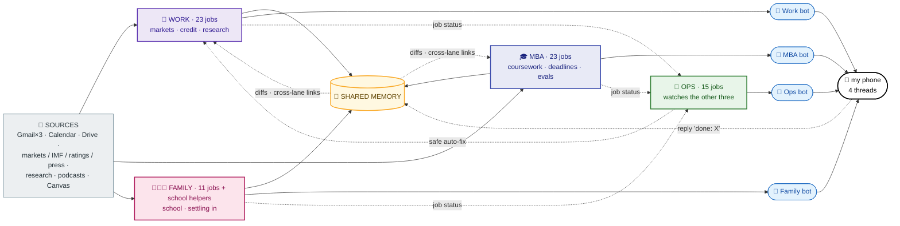
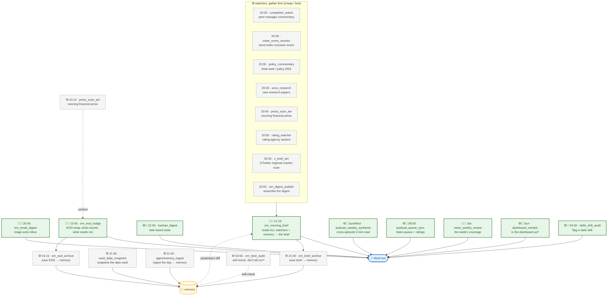
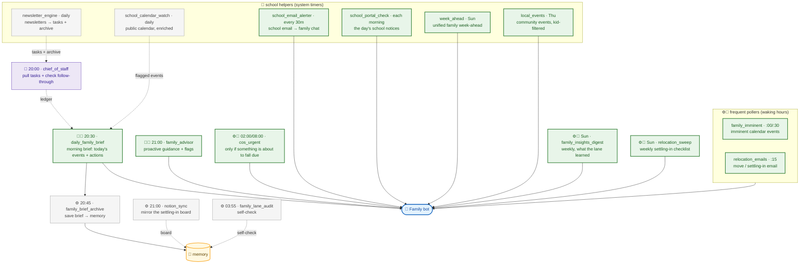
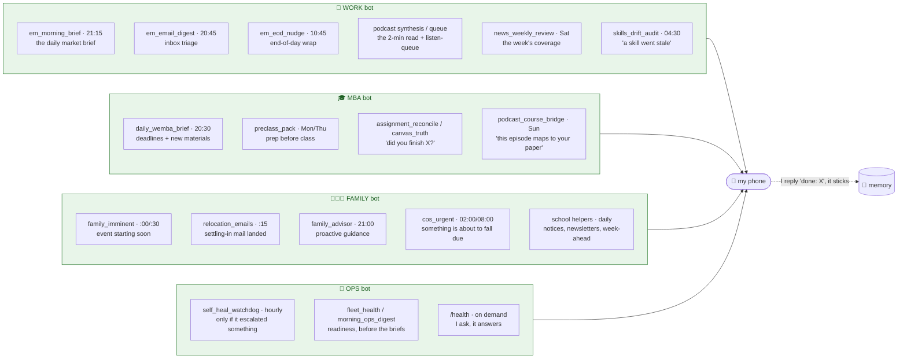
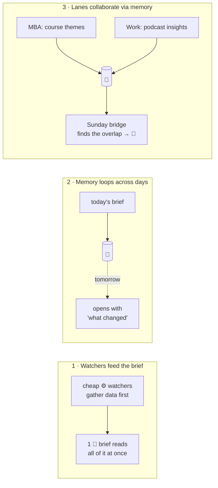

# 8 · The fleet map: everything, on one page

This is the **whole system in one picture**: every scheduled job across the fleet's four lanes, what each one does, how they connect, and exactly which ones reach my phone over Telegram.

If you only look at one diagram in this repo, make it this one. (The [schedule](06-the-schedule.md) has the same jobs as tables with times; this is the *visual* of how they wire together.)

## How to read it

| Symbol | Meaning |
|--------|---------|
| 🧠 | **Agent job**: calls the AI to read, judge, and write. Costs a little money. |
| ⚙️ | **No-agent job**: a script (deterministic, or one cheap model call). Most jobs are these. |
| 📱 | **Pings my phone**: surfaces to that lane's Telegram bot. |
| 🗃️ → memory | Writes data other jobs read later. I'm *not* pinged. |
| dashed arrow | "Tomorrow reads yesterday", a memory loop across days. |

> All times are **UTC**. My local morning is ~20:30 UTC.

---

## The whole fleet, on one page

The fleet is ~70 jobs, so one all-in-one graph renders too small to read on GitHub. So here it is in **two zooms**: first the *shape* of the whole thing, then **each content lane up close** with every job. Same colour key throughout, **green = pings my phone**, purple = AI/agent, grey = free plumbing, amber = shared memory, blue = Telegram bots.

### Zoom 1, the shape of the whole fleet

Four lanes write into one shared memory and speak through four separate bots; the ops lane sits above and watches the other three. Now the detail, one lane at a time.

### Zoom 2a, 💼 WORK lane (23 jobs)

The pattern to notice: a stack of cheap **watchers** gather data first, then **one** AI brief reads all of it. Green nodes are the ones that surface to me.

### Zoom 2b, 🎓 MBA lane (23 jobs)

Two clusters: the **study help** (brief, chief-of-staff, pre-class packs, weekly notes) and the **guardrails** (evals, ledger invariants, Canvas reconciliation) that keep the coursework data honest. Its smartest weekly output is the cross-lane link between a podcast and a course.

```mermaid
flowchart TB
    drive["⚙️ every 30m · drive_watch<br/>watch Drive for new coursework"]:::plumb
    pre["⚙️ every 30m · preclass_brief<br/>prep a brief if class is imminent"]:::plumb
    hb["⚙️ every 6h · canvas_heartbeat<br/>is the Canvas data fresh?"]:::plumb
    catchup["⚙️📱 every 15m · canvas_catchup<br/>tick off fresh submissions fast"]:::ping
    chealth["⚙️📱 hourly · canvas_health<br/>is the Canvas pipeline itself ok?"]:::ping
    eclose["⚙️📱 every 3h · email_close<br/>close items email proves done"]:::ping
    commit["⚙️ 20:30 · commitments<br/>mine sent mail for promises made"]:::plumb
    brief["🧠📱 20:30 · daily_wemba_brief<br/>study brief: deadlines, materials, email"]:::ping
    cos["🧠 21:00 · chief_of_staff<br/>deadlines + follow-through"]:::agent
    coseod["🧠 09:00 · chief_of_staff_eod<br/>evening pass"]:::agent
    radar["🧠 21:15 · prof_email_radar<br/>what in course email needs action"]:::agent
    cal["⚙️ 21:00 · calendar_sync<br/>keep the class calendar true"]:::plumb
    recon["⚙️📱 21:00 · assignment_reconcile<br/>assignments vs evidence they're done"]:::ping
    ctruth["⚙️📱 every 3h · canvas_truth<br/>reconcile vs Canvas (source of truth)"]:::ping
    pack["🧠📱 Mon/Thu · preclass_pack<br/>deeper prep before class days"]:::ping
    eod["🧠 01:00 · wemba_eod_nudge<br/>tomorrow's prep"]:::agent
    meval["⚙️📱 Sun · matcher_eval<br/>labeled matching regression suite"]:::ping
    inv["⚙️📱 Sun · ledger_invariants<br/>completion-ledger invariants hold?"]:::ping
    synth["🧠 Sun 22:00 · weekly_synthesis<br/>model panel writes course notes"]:::agent
    load["🧠 Sun 22:00 · load_forecast<br/>next week's coursework load"]:::agent
    cad["⚙️📱 Sun · canvas_cadence_report<br/>weekly coverage report"]:::ping
    bridge["⚙️📱 Sun 23:30 · podcast_course_bridge<br/>links coursework ↔ podcast themes"]:::ping
    aud["⚙️ 03:55 · wemba_lane_audit<br/>self-check"]:::plumb
    work["💼 Work lane's podcast<br/>insights (tag: startup-ai)"]:::agent
    mem[("🧠 shared memory")]:::mem
    bot(["🤖 MBA bot"]):::bot

    drive --> brief
    pre --> brief
    hb -. "freshness" .-> ctruth
    catchup -. "quick closes" .-> ctruth
    eclose -. "email closes" .-> ctruth
    chealth -. "pipeline ok?" .-> ctruth
    commit -. "'you owe' items" .-> brief
    brief --> bot
    brief --> cos
    cos --> recon
    recon --> bot
    ctruth --> bot
    radar -. "actions" .-> mem
    pack --> bot
    meval --> bot
    inv --> bot
    cad --> bot
    synth --> mem
    load -. "forecast" .-> mem
    work --> mem
    mem -. "course themes + podcast insights" .-> bridge
    bridge --> bot

    classDef agent fill:#ede7f6,stroke:#5e35b1,color:#311b92;
    classDef plumb fill:#f5f5f5,stroke:#9e9e9e,color:#424242;
    classDef ping fill:#e8f5e9,stroke:#2e7d32,color:#1b5e20,stroke-width:2px;
    classDef mem fill:#fff8e1,stroke:#f9a825,color:#5f4300,stroke-width:2px;
    classDef bot fill:#e3f2fd,stroke:#1565c0,color:#0d47a1,stroke-width:2px;
```

### Zoom 2c, 👨‍👩‍👧 FAMILY lane (11 jobs + school helpers)

The most time-sensitive lane. The move has happened, so the centre of gravity is now school life and settling in; it still polls often during waking hours, and a cluster of **school helpers** (system timers rather than lane cron jobs) feeds it.

> The **ops lane** (the 4th, supervisory one, 15 jobs) has its own close-up in [09 · The ops lane](09-the-ops-lane.md).

**Green nodes ping my phone.** Purple nodes think (AI). Grey nodes are free plumbing into the amber memory store. That's the whole fleet: ~70 jobs, and only the briefs, digests and alerts ever interrupt me, the watchers stay silent.

---

## Just the Telegram side: who is allowed to ping me, and when

The single most important design choice is **restraint**: most jobs never reach my phone. Here's only the part that *can* interrupt me, by lane:

Notice the asymmetry: the **family** bot is the chattiest (school life and settling into a new country are time-sensitive), the **work** bot fires on a predictable rhythm around the morning brief, the **MBA** bot surfaces a daily study brief plus its smartest weekly output (the cross-lane podcast↔course link), and the **ops** bot stays quiet unless the fleet itself needs help (or I ask it `/health`). Everything else those lanes do is quiet plumbing into memory. (The ops lane gets its own chapter: [09 · The ops lane →](09-the-ops-lane.md).)

And it's **two-way**: every bot is a conversation, not a broadcast. I reply `done: <thing>` and the agent marks it complete in memory; I can ask a corpus query and it searches on demand. (More in [memory](04-memory.md).)

---

## The three connection patterns worth noticing

Strip away the seventy boxes and there are really only **three wiring tricks** doing the work:

1. **Watchers → brief.** Several free scripts do the gathering so the *one* paid AI call only does the judging. (Cost control, [design principles](05-design-principles.md).)
2. **Memory across days.** A brief is archived the moment it's sent, so tomorrow's can open with a diff, *"since yesterday: S&P upgraded the outlook."*
3. **Lanes collaborate.** The work lane's podcast insights and the MBA lane's course themes live in the same memory; a Sunday job reads both and spots the overlap. Two agents that never call each other still cooperate, through shared memory. (See [memory](04-memory.md).)

---
**Next:** [01 · What is an agent? →](01-what-is-an-agent.md) (back to the start)

**Back to:** [README](../README.md) · [Schedule](06-the-schedule.md) · [Architecture](02-architecture.md) · [Memory](04-memory.md)
