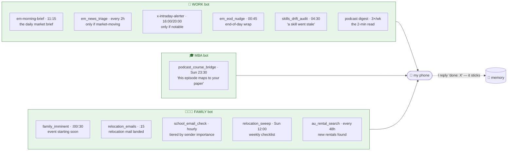
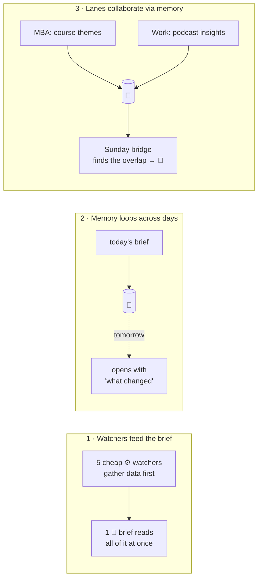

# 8 · The fleet map: everything, on one page

This is the **whole system in one picture** — every scheduled job across the three lanes, what each one does, how they connect, and exactly which ones reach my phone over Telegram.

If you only look at one diagram in this repo, make it this one. (The [schedule](06-the-schedule.md) has the same jobs as tables with times; this is the *visual* of how they wire together.)

## How to read it

| Symbol | Meaning |
|--------|---------|
| 🧠 | **Agent job** — calls the AI to read, judge, and write. Costs a little money. |
| ⚙️ | **No-agent job** — pure script, no AI, free. Most jobs are these. |
| 📱 | **Pings my phone** — delivers to that lane's Telegram bot. |
| 🗃️ → memory | Writes data other jobs read later. I'm *not* pinged. |
| dashed arrow | "Tomorrow reads yesterday" — a memory loop across days. |

> All times are **UTC**. My morning is ~11:00 UTC (≈ 6–7am US Eastern).

---

## The whole fleet, on one page

```mermaid
flowchart TB
    %% ---------- DATA SOURCES ----------
    subgraph SRC["📡 DATA SOURCES"]
        direction LR
        gmail["📨 Gmail ×3"]
        gcal["📅 Calendar"]
        gdrive["📑 Drive"]
        news["📰 News / RSS<br/>Bloomberg · IMF · ratings"]
        xfeed["🐦 X / Twitter"]
        pods["🎙️ 16 podcasts"]
        mkts["📊 Prediction mkts"]
    end

    %% ---------- WORK LANE ----------
    subgraph WORK["💼 WORK lane · em · 17 jobs"]
        direction TB
        w_imf["⚙️ 10:10 Sun/Wed · imf-watcher<br/>IMF program news → file"]:::plumb
        w_pol["⚙️ 10:30 · policy-commentary<br/>think-tank / policy RSS → file"]:::plumb
        w_eml["🧠 10:45 · em_email_digest<br/>triage work inbox → file"]:::agent
        w_rat["⚙️ 10:50 · rating-watcher<br/>rating-agency actions → file"]:::plumb
        w_xam["⚙️ 10:55 · x-brief-am<br/>morning EM chatter (Grok) → file"]:::plumb
        w_brief["🧠📱 11:15 · em-morning-brief<br/>reads ALL above + memory,<br/>writes the brief"]:::ping
        w_arch["⚙️ 11:30 · em_brief_archive<br/>save brief → memory"]:::plumb
        w_pos["⚙️ 11:32 · em_position_log<br/>snapshot positions → memory"]:::plumb
        w_poly["⚙️ 11:00/21:00 · polymarket_snapshot<br/>prediction-market odds → file"]:::plumb
        w_news["⚙️📱 every 2h Mon–Fri · em_news_triage<br/>Bloomberg alerts — ping if market-moving"]:::ping
        w_intra["⚙️📱 16:00/20:00 · x-intraday-alerter<br/>intraday X signal — ping if notable"]:::ping
        w_xpm["⚙️ 21:00 · x-brief-pm<br/>evening EM chatter → file"]:::plumb
        w_aaa["⚙️ 22:00 Mon–Fri · em_after_action_audit<br/>review day's calls vs outcomes"]:::plumb
        w_eod["🧠📱 00:45 · em_eod_nudge<br/>end-of-day wrap: what moved,<br/>what needs me tomorrow"]:::ping
        w_eoda["⚙️ 01:15 · em_eod_archive<br/>save EOD wrap → memory"]:::plumb
        w_aud["⚙️ 03:55 · em_lane_audit<br/>self-check: did it all run?"]:::plumb
        w_drift["⚙️📱 04:30 · skills_drift_audit<br/>flag a stale agent skill"]:::ping
    end

    %% ---------- MBA LANE ----------
    subgraph MBA["🎓 MBA lane · wemba · 9 jobs"]
        direction TB
        m_drive["⚙️ every 30m · wemba_drive_watch<br/>watch Drive for new coursework"]:::plumb
        m_pre["⚙️ every 30m · wemba_preclass_brief<br/>prep a brief if class is imminent"]:::plumb
        m_brief["🧠 11:00 · daily_wemba_brief<br/>study brief: deadlines, materials, email"]:::agent
        m_risk["🧠 12:00 · wemba_atrisk_radar<br/>flag deliverables at risk of slipping"]:::agent
        m_sweep["⚙️ 13:00 · wemba_completion_sweep<br/>Drive vs deliverables — 'did you finish X?'"]:::plumb
        m_eod["🧠 01:00 · wemba_eod_nudge<br/>end-of-day: tomorrow's prep"]:::agent
        m_aud["⚙️ 03:55 · wemba_lane_audit<br/>self-check"]:::plumb
        m_synth["⚙️ 22:00 Sun · wemba_weekly_synthesis<br/>week's coursework → memory"]:::plumb
        m_bridge["⚙️📱 23:30 Sun · podcast_course_bridge<br/>link coursework ↔ podcast themes"]:::ping
    end

    %% ---------- FAMILY LANE ----------
    subgraph FAM["👨‍👩‍👧 FAMILY lane · family · 9 jobs"]
        direction TB
        f_imm["⚙️📱 :00/:30 waking · family_imminent<br/>imminent calendar events — ping"]:::ping
        f_reloc["⚙️📱 :15 waking · relocation_emails<br/>relocation email — ping"]:::ping
        f_school["⚙️📱 hourly 11–23 · school_email_check<br/>school emails, tiered by sender"]:::ping
        f_brief["🧠 11:00 · daily_family_brief<br/>morning brief: today's events + actions"]:::agent
        f_arch["⚙️ 11:15 · family_brief_archive<br/>save brief → memory"]:::plumb
        f_cd["⚙️ 12:00 · family_au_countdown<br/>countdown to move-day (T-30/14/7/3/1)"]:::plumb
        f_sweep["⚙️📱 12:00 Sun · relocation_sweep<br/>weekly relocation-checklist sweep"]:::ping
        f_rent["⚙️📱 every 48h · au_rental_search<br/>scan rentals in destination city"]:::ping
        f_aud["⚙️ 03:55 · family_lane_audit<br/>self-check"]:::plumb
    end

    %% ---------- SHARED SERVICES ----------
    digest["🎙️ Podcast digest<br/>(laptop 3×/wk · Sun fallback)<br/>16 feeds → tagged 2-min read"]:::agent
    MEM[("🧠 SHARED MEMORY<br/>briefs · positions · course themes ·<br/>podcast insights · 'done' replies")]:::mem

    %% ---------- TELEGRAM ----------
    subgraph TG["📱 TELEGRAM — three separate bots"]
        direction LR
        bw["🤖 Work bot"]:::bot
        bm["🤖 MBA bot"]:::bot
        bf["🤖 Family bot"]:::bot
    end
    ME(["👤 One phone,<br/>three threads"]):::me

    %% ---------- WIRING: sources into lanes ----------
    news --> w_imf & w_pol & w_rat & w_news
    gmail --> w_eml & f_reloc & f_school
    xfeed --> w_xam & w_xpm & w_intra
    mkts --> w_poly
    gdrive --> m_drive
    gcal --> f_imm
    pods --> digest

    %% ---------- WIRING: work lane internal ----------
    w_imf & w_pol & w_eml & w_rat & w_xam --> w_brief
    MEM -. "yesterday's diff" .-> w_brief
    w_brief --> w_arch --> MEM
    w_xpm --> w_eod
    w_eod --> w_eoda --> MEM
    w_pos --> MEM
    digest --> MEM

    %% ---------- WIRING: cross-lane bridge ----------
    m_synth --> MEM
    MEM -. "course themes + podcast insights" .-> m_bridge

    %% ---------- WIRING: family internal ----------
    f_brief --> f_arch --> MEM

    %% ---------- WIRING: to Telegram ----------
    w_brief & w_news & w_intra & w_eod & w_drift --> bw
    digest --> bw
    m_bridge --> bm
    f_imm & f_reloc & f_school & f_sweep & f_rent --> bf

    bw & bm & bf --> ME
    ME -. "reply: 'done: X' / corrections" .-> MEM

    classDef agent fill:#ede7f6,stroke:#5e35b1,color:#311b92;
    classDef plumb fill:#f5f5f5,stroke:#9e9e9e,color:#424242;
    classDef ping  fill:#e8f5e9,stroke:#2e7d32,color:#1b5e20,stroke-width:2px;
    classDef mem   fill:#fff8e1,stroke:#f9a825,color:#5f4300,stroke-width:2px;
    classDef bot   fill:#e3f2fd,stroke:#1565c0,color:#0d47a1,stroke-width:2px;
    classDef me    fill:#fce4ec,stroke:#ad1457,color:#880e4f;
```

**Green nodes ping my phone.** Purple nodes think (AI). Grey nodes are free plumbing that just feeds the amber memory store. That's the whole fleet: ~35 jobs, and only a handful ever interrupt me.

---

## Just the Telegram side: who is allowed to ping me, and when

The single most important design choice is **restraint** — most jobs never reach my phone. Here's only the part that *can* interrupt me, by lane:

Notice the asymmetry: the **family** bot is the chattiest (school + an international move are time-sensitive), the **work** bot fires on a predictable rhythm with two "only-if-it-matters" interrupters, and the **MBA** bot deliberately pings *once a week* with its smartest output — the cross-lane link between a podcast and a course. Everything else those lanes do is quiet plumbing into memory.

And it's **two-way**: every bot is a conversation, not a broadcast. I reply `done: <thing>` and the agent marks it complete in memory; I can ask `/podcast_q oil Iran` and it searches the corpus on demand. (More in [memory](04-memory.md).)

---

## The three connection patterns worth noticing

Strip away the 35 boxes and there are really only **three wiring tricks** doing the work:

1. **Watchers → brief.** Five free scripts do the gathering so the *one* paid AI call only does the judging. (Cost control, [design principles](05-design-principles.md).)
2. **Memory across days.** A brief is archived the moment it's sent, so tomorrow's can open with a diff — *"since yesterday: S&P upgraded SA outlook."*
3. **Lanes collaborate.** The work lane's podcast insights and the MBA lane's course themes live in the same memory; a Sunday job reads both and spots the overlap. Two agents that never call each other still cooperate — through shared memory. (See [memory](04-memory.md).)

---
**Next:** [01 · What is an agent? →](01-what-is-an-agent.md) (back to the start)

**Back to:** [README](../README.md) · [Schedule](06-the-schedule.md) · [Architecture](02-architecture.md) · [Memory](04-memory.md)
