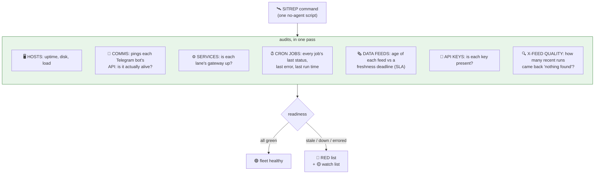
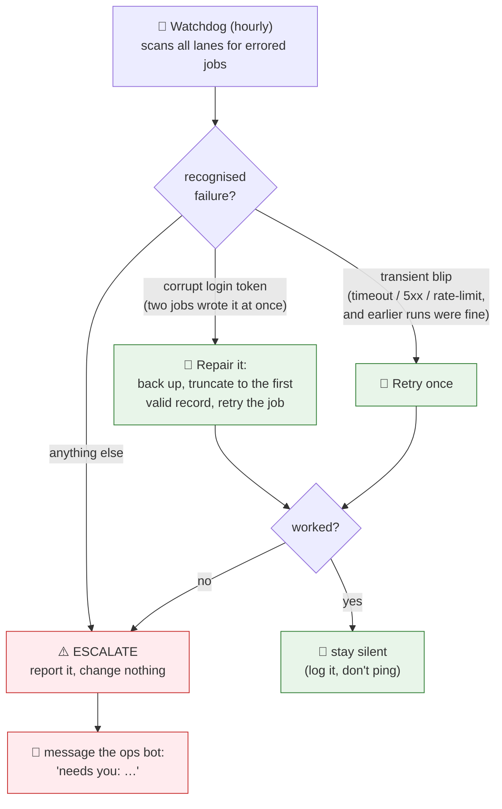
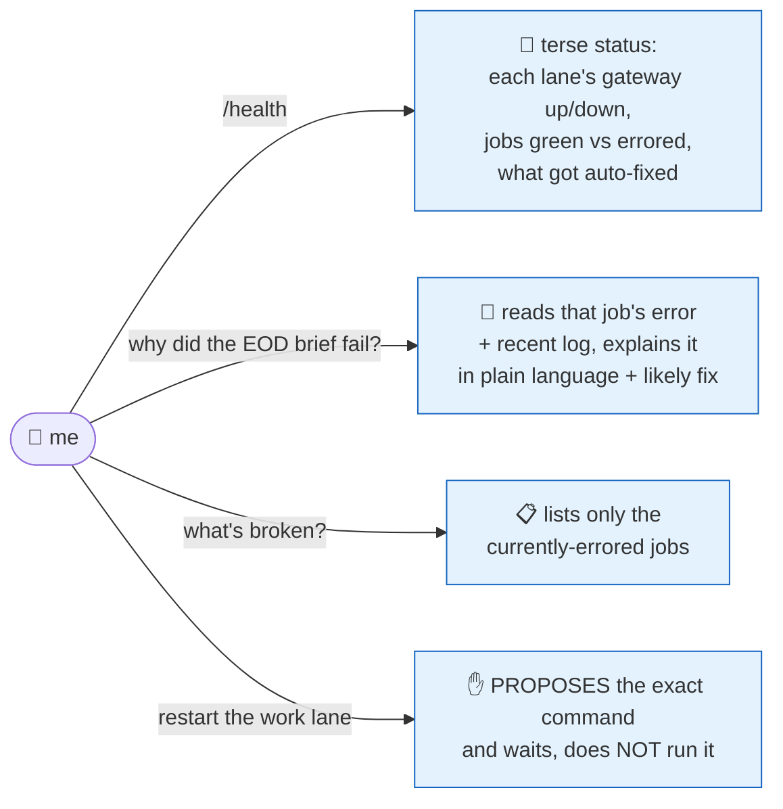
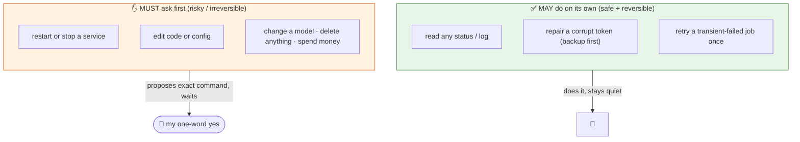
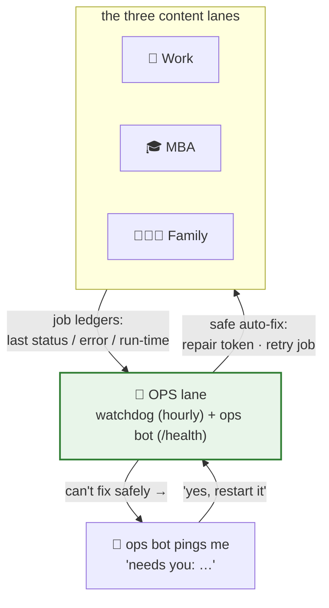

# 9 · The ops lane: the fleet that watches the fleet

Thirty-five jobs run every day on a small server I don't look at. Things *will* break, a feed goes stale, a login token gets corrupted, a model returns an empty response at 1am. The dangerous failure isn't the one that pages me; it's the one that **fails silently** and I find out three days later that my morning brief has been blank.

So the fleet has a **fourth lane** whose only job is to watch the other three. It has three parts, escalating in autonomy:

1. **A command centre**: one command, a full readiness picture.
2. **A self-healing watchdog**: fixes the safe stuff on its own, hourly.
3. **An ops bot**: a fourth Telegram bot I can *ask* "what's broken?", that proposes fixes for the risky stuff.

The thread running through all three is a single hard rule: **fix what's safe and reversible; ask before anything else.** That boundary is the whole design.

---

## 1 · The command centre: one command, full readiness

The first thing you need when you run unattended automation is a single place to answer *"is everything actually working right now?"*, not "did the server boot," but "is every individual job, feed, bot and key healthy?"

That's a script I call the **SITREP** (a military "situation report"). I run it and it audits the entire fleet across the server in one pass, then renders a colour-coded readiness board:

Two of those checks are subtler than "is it on?" and worth calling out, because they catch the failures that *don't* announce themselves:

- **Feed freshness (SLAs).** Each data feed has a deadline, the X market-chatter feed should be under ~16h old (it runs morning + evening); the IMF feed under 48h. A feed that's simply *old* is flagged 🔴 even though nothing "errored." A stale feed is a job that quietly stopped producing.
- **X-feed quality, not just liveness.** The live-market scan can run "successfully" and still return *"no material chatter"* every time, technically working, actually useless. So the SITREP counts how many of the last 10 runs came back empty: 3/10 is a yellow flag, 6/10 is red. **A job can be green on "did it run?" and red on "did it produce anything worth having?"**, and only the second one matters.

The output is a board of 🟢 / 🟡 / 🔴, with everything broken collected into a "RED list" at the top. One glance answers *"what needs me?"*

---

## 2 · The self-healing watchdog: fix the safe stuff, hourly

A readiness board is only useful if someone reads it. I won't, reliably. That's the whole point of the fleet. So most of the monitoring is **self-correcting**: a watchdog runs every hour (a no-agent job, free), scans every lane's jobs for an `error` status, and tries to fix the ones it *knows how to fix safely*.

The trick is a tiny **whitelist** of repairs that are genuinely safe and reversible. Everything else is reported, never touched:

Two real examples of the whitelist:

1. **Corrupt login token.** Several jobs share one Google login file. Occasionally two write it at the same instant and tear it, every job that needs Google then fails with a JSON parse error. The fix is mechanical and safe: back the file up, keep the first valid record, drop the garbage, atomically replace, re-run the affected jobs. The watchdog does this itself.
2. **A transient blip.** A job that failed *once* with a timeout / a 5xx / a rate-limit, but whose earlier runs were fine, gets exactly **one** retry. Crucially, a *bare* failure with no network signature is **not** retried, it's escalated, so a genuine bug never gets quietly papered over by a retry loop.

Three design choices make this safe rather than scary:

- **It's silent when it works.** If everything's green, or it fixed something cleanly, it says nothing. It only messages me when it had to escalate. No news is good news; a ping means *act.*
- **It refuses to mask bugs.** "Unknown failure" is a category, and that category's only action is *tell a human.* Auto-fixing is a short whitelist, not a default.
- **It can't touch anything expensive.** No editing code, no changing models, no restarting services, no spending money. The hard line is drawn at *safe + reversible*.

That last point is important enough to be its own section.

---

## 3 · The ops bot: an on-call SRE I can talk to

The watchdog is the *automatic* face of fleet health. The **ops bot** is the *interactive* one, a fourth Telegram bot, separate from work / MBA / family, that is explicitly **not a content lane** (ask it about Egypt's IMF program and it tells you to go talk to the work bot). It's the same intelligence as the watchdog, but conversational:

`/health` is the one I use most: it reads every lane's job ledger and prints a one-screen verdict, *"🟢 All 35 jobs green. work gateway up 6h. Last auto-fix: repaired login token 22:00."* When something's red, I can ask **"why did `em_eod_nudge` fail?"** and it reads the actual error and the recent log and explains it like a colleague would, *"context overflow, 9.5k tokens; a fallback model hit a smaller window, want me to trim the prompt? (needs your ok, it's a config change)."*

### The boundary that makes it trustworthy

Notice the last branch above. Ask the ops bot to **restart a lane** and it does *not* do it; it prints `systemctl restart hermes-work` and waits for me to say yes. That's deliberate, and it's the same line the watchdog draws:

This is the most important idea in the whole repo, applied to the riskiest lane: **an agent with hands needs a fence.** The ops bot can reach into the system and *change* things, so the set of things it may change without asking is a short, audited whitelist of the safe-and-reversible, and *everything* else is "propose and wait." When it's unsure which side of the line something is on, it treats it as needs-confirmation. The result is an assistant that's genuinely useful at 2am, it has already fixed the torn token before I wake up, without ever being one that restarts the wrong service on its own.

---

## How the ops lane connects to the rest

It sits *above* the three content lanes and reads their health, rather than alongside them producing content:

The three lanes look after my work, school, and family. The ops lane looks after **them**: quietly fixing what it safely can, and tapping me on the shoulder, in plain language, for the rest.

## See the real code

The actual (lightly sanitized) scripts behind this chapter are in [`examples/`](../examples/):

- [`fleet_health.py`](../examples/fleet_health.py) , the no-LLM `/health` check
- [`self_heal_watchdog.py`](../examples/self_heal_watchdog.py) , the hourly safe-remediation watchdog
- [`sitrep_readiness.py`](../examples/sitrep_readiness.py) , the command-centre scoring core (runs as-is)
- [`skill_drift_audit.sh`](../examples/skill_drift_audit.sh) + [`skill_lint.py`](../examples/skill_lint.py) + [`skillify.sh`](../examples/skillify.sh) , the skill-curation trio

---
**Next:** [10 · What it costs →](10-what-it-costs.md)

**Back to:** [README](../README.md) · [Fleet map](08-the-fleet-map.md) · [Schedule](06-the-schedule.md) · [Design principles](05-design-principles.md)
