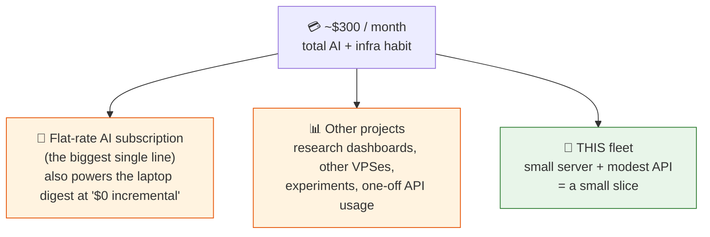

# 10 · What it actually costs

Most write-ups of "my AI setup" are coy about money. Here's the honest version, with the important distinction up front:

> **The fleet itself is cheap: a single small server plus a modest API bill.** My *total* AI + infrastructure spend is about **$300/month**, but that's my whole habit across many projects, not this fleet. Don't let one number mislead you in either direction.

## The fleet's own cost

| Line item | Rough cost | Why it's small |
|-----------|-----------|----------------|
| The server | **~$5-8 / month** | One small VPS runs all four lanes, the memory service, and the scheduler. |
| Fleet API calls | **tens of dollars / month** | Most jobs are **no-agent** (pure scripts, $0). Only a handful of jobs per day call an LLM, and those use cheap-first routing. |
| The heavy podcast digest | **$0 incremental** | It runs on my laptop under a flat-rate AI subscription I already pay for; the cloud server only runs it as a weekend fallback. |

Three design choices keep the fleet's API bill in the tens, not hundreds:

1. **No-agent by default.** Roughly three-quarters of the ~70 daily jobs never call the AI at all. Watchers, archivers, audits, and counters are deterministic code. The LLM is reserved for the genuinely hard part: reading messy input and judging what matters. (See [design principles](05-design-principles.md).)
2. **Cheap-first routing.** Bulk work goes to a fast cheap model; only the few jobs that need real reasoning (the morning brief, the weekly synthesis) get a flagship. ([Architecture: the model router](02-architecture.md).)
3. **One flagship call where it counts.** Five free watchers gather data first, so the one paid morning-brief call reads everything at once instead of paying for five separate AI passes. ([The fleet map](08-the-fleet-map.md).)

## So where does the ~$300/month go?

Almost all of it is **everything else**, not this fleet:

- **The flat-rate AI subscription** is the largest single line. It's a sunk cost I'd pay regardless, and it's *why* the podcast digest is "$0 incremental": the laptop does that heavy work under the subscription instead of metered API.
- **Other projects** (research dashboards, separate servers, experiments) make up most of the rest. They have nothing to do with the agent fleet.
- **This fleet** is a small slice of the total.

## The honest takeaway

If you're wondering *"could I afford something like this?"*: the **fleet** is genuinely a few dollars of server plus tens of dollars of API a month. The scary-sounding **$300** is what happens when you run a dozen AI side-projects at once, not what this particular system costs.

And the discipline that keeps the fleet cheap is the same discipline worth having for the whole habit: **log what each job actually does, and only pay the AI for judgment, not plumbing.** One early job quietly burned ~$15/month calling the AI every 30 minutes to report "nothing." Finding those is ongoing. ([The cautionary tale](05-design-principles.md).)

---
**Next:** [11 · When it goes wrong →](11-when-it-goes-wrong.md)

**Back to:** [README](../README.md) · [Design principles](05-design-principles.md) · [Architecture](02-architecture.md)
