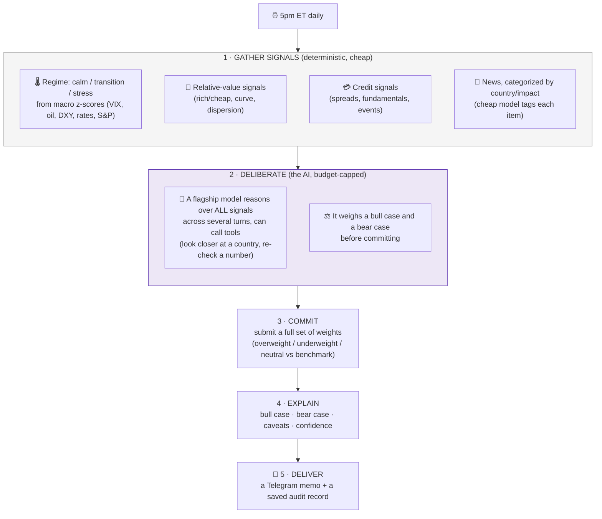
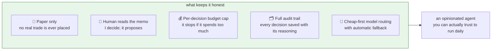
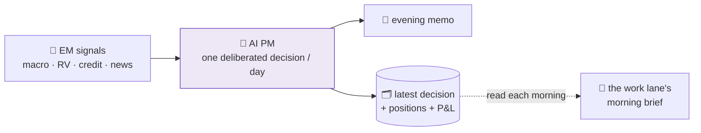

# 14 · The AI PM: an agent that actually makes the call

The three lanes [brief me](06-the-schedule.md). This one is different: it **makes a decision**. Every weekday evening, an "AI portfolio manager" reviews a 10-country emerging-market sovereign-credit book, **decides how it would be positioned**, writes up its reasoning, and texts me a memo. It trades on **paper only**, so the stakes are a learning experiment, not my actual book. But the *workflow* is the interesting part: it's the clearest example in this whole project of an agent doing real, structured judgment under guardrails.

> **Paper trading, on purpose.** No real money moves. It proposes a position; I read the memo and decide what (if anything) to do in real life. The point is to test whether deliberated AI reasoning over many signals produces useful calls.

## The universe

Ten EM sovereigns it can be overweight, underweight, or neutral on, each versus a benchmark weight: Brazil, Mexico, Colombia, Turkey, South Africa, Egypt, Nigeria, Ghana, Indonesia, Pakistan.

## The daily decision workflow

Once a day (5pm New York time, after the US session), it runs one full decision:

The shape is the same cost discipline as everywhere else ([design principles](05-design-principles.md)): **cheap deterministic work gathers the evidence; the expensive AI is spent only on the hard judgment** of what it all means for positioning.

## What a decision actually contains

The output isn't a vibe, it's a structured object the memo is built from:

- **Regime call** (calm / transition / stress) with the macro read behind it
- **Weights**: a number per country, and the *active* weight (vs benchmark) that says overweight or underweight
- **The changes** versus yesterday's decision, and why
- **A bull case and a bear case** in plain language
- **Caveats**: the things that would make it wrong (*"oil reversal would hurt the Nigeria overweight"*)
- **Confidence**: low / medium / high
- **Cost**: what that decision spent in API tokens (every decision is budgeted)

## The guardrails that make an agent-with-opinions safe

An agent that *decides* needs a tighter fence than one that just summarises. Five of them:

- **Paper only.** It can be wrong without costing anything real.
- **Propose, don't execute.** Same principle as the [ops lane](09-the-ops-lane.md): the agent forms the view; the human acts on it.
- **A budget per decision.** Each run has a token/cost ceiling. If the deliberation runs long, it wraps up rather than burning money, and the decision is flagged "degraded" so I know it was cut short.
- **An audit trail.** Every decision is saved as a record (regime, signals it saw, the weights, the reasoning), so a bad call can be inspected later, not just shrugged at.
- **Cheap-first routing.** Bulk work (tagging news) uses a fast cheap model; only the core deliberation gets a flagship; if a provider flakes it falls through to the next. ([the model router](02-architecture.md))

## How it connects to the rest of the fleet

It's the **work lane's deeper cousin**. The work lane reads the firehose and briefs me; the AI PM takes the same kind of EM inputs and goes one step further, to an actual positioning call, which then feeds *back* into the morning brief as one more input:

So the morning brief can open with *"the PM is overweight Nigeria into a benign-vol regime; here's what changed overnight"*, because last night's decision is sitting in shared storage waiting to be read.

## The honest disclaimers (again, louder)

- **It is a paper experiment**, not investment advice and not my real book.
- **It is often wrong.** The whole design assumes that: caveats, a bear case, confidence levels, and a human in the loop exist precisely because a confident-sounding AI making market calls is exactly the thing to be skeptical of.
- **The value being tested** is narrow: can deliberated reasoning over many signals beat a naive benchmark on paper, cheaply enough to be worth it? That is an open question, which is the point.

See [`examples/pm_decision_loop.py`](../examples/pm_decision_loop.py) for a sanitized sketch of the gather → deliberate → commit loop.

---
**Back to:** [README](../README.md) · [Architecture](02-architecture.md) · [Design principles](05-design-principles.md) · [Ops lane](09-the-ops-lane.md)
