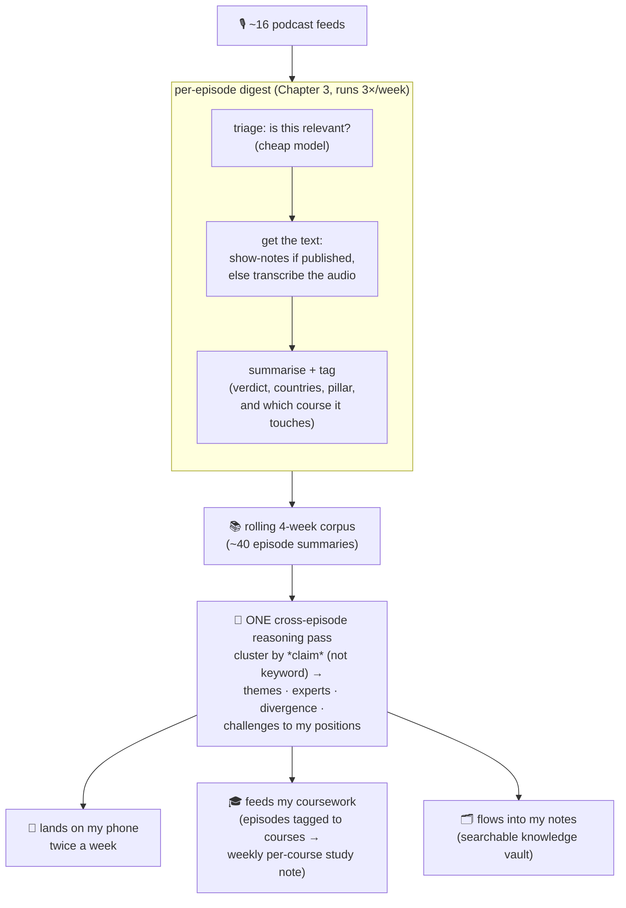

# 15 · From episodes to insight: cross-episode synthesis

[Chapter 3](03-the-digest-pipeline.md) turned 20 hours of weekly audio into a per-episode summary. Useful, but the *real* signal isn't in any single episode. It's in the **pattern across episodes**: when four unrelated shows independently land on the same theme, or when a respected voice argues the opposite of how my portfolio is positioned. That cross-episode pattern is what a human who actually listened to everything would notice. This chapter is the agent that notices it for me.

## What it produces

Twice a week a short briefing lands on my phone with four things, each built from the *whole* rolling 4-week corpus (~40 episodes across ~16 shows), not one episode:

- **🎯 Top themes**, claims multiple shows converge on, scored by how many independent sources and how strong the conviction. "Four shows now treat AI capex as a macro/rates force, but they split on whether it's inflationary."
- **🗣️ Expert voices**, who is saying what, *across* their appearances. Someone doing four podcast circuits with the same thesis is a louder signal than one off-hand remark.
- **⚖️ Divergent takes**, the minority view on a contested topic, named. Disagreement is more actionable than consensus.
- **🔁 Challenges to my positions**, the bit I value most: it cross-references the views against my actual paper-portfolio and flags where an expert contradicts a position I hold.

## How it works

The clever part is that this is **not** a second round of listening. It reuses the per-episode summaries the digest already made, and does *one* reasoning pass over all of them.

**Cluster by claim, not by keyword.** The naive version ("three episodes mentioned Pakistan → a theme!") produces mush. The useful version is: *"X says the IMF tranche lands in May, Y agrees, Z says it slips on politics → they converge on the tranche being pivotal but diverge on timing."* A reasoning model does that nuance in a single call; no embeddings gymnastics required.

**Every claim is cited.** Each theme and quote traces back to a specific show and episode. Without that, you can't tell a real expert view from a hallucinated one, so the agent is required to cite, and an uncited claim is dropped.

**It runs cheap.** The heavy synthesis uses a free subscription tier on my laptop when it's awake, and falls back to inexpensive cloud models otherwise. The whole thing costs cents a week.

## It feeds two other agents

The synthesis isn't a dead-end report, it's plumbing for the rest of the fleet:

- **My coursework.** Startup/AI episodes get tagged with the Wharton course they touch (entrepreneurship, scaling-operations) and a one-line "how this applies to a paper or my own project." A separate weekly job rolls those into a per-course study note. A podcast becomes exam prep.
- **My notes.** Everything (episode summaries, the cross-episode synthesis, the course notes) lands in a single searchable knowledge vault (see [Chapter 4 · Memory](04-memory.md)), organised by topic, so months later I can ask "what did people say about Hormuz in May?" and get cited answers.

## The honest part: two failures this caught

This pipeline is a good illustration of [Chapter 11's](11-when-it-goes-wrong.md) theme, the dangerous failures are the *silent* ones:

1. **A silently-dropped episode.** The digest marked an episode "already seen" *before* confirming it had successfully fetched the text. One transcript fetch failed, the episode got flagged seen anyway, and it vanished, never retried, never surfaced. The fix: only mark an episode seen once it actually has content, so a failure retries on the next run instead of disappearing forever.
2. **A provider's billing lapsed.** Two helper steps (relevance triage and similarity embeddings) ran on one cloud provider whose billing quietly went into a denied state, every call started 403-ing. Because those steps "fail soft" (triage defaults to *keep*, the synthesis re-clusters from text itself), nothing crashed and nothing alerted; the quality just quietly degraded. The fix: move both steps onto the provider the rest of the fleet already uses, removing the dependency entirely.

Both are the same lesson in different clothes: **build for the failure you won't be paged about.**

---
**Next:** [04 · How the agents remember →](04-memory.md) · or back to the [index](../README.md)
