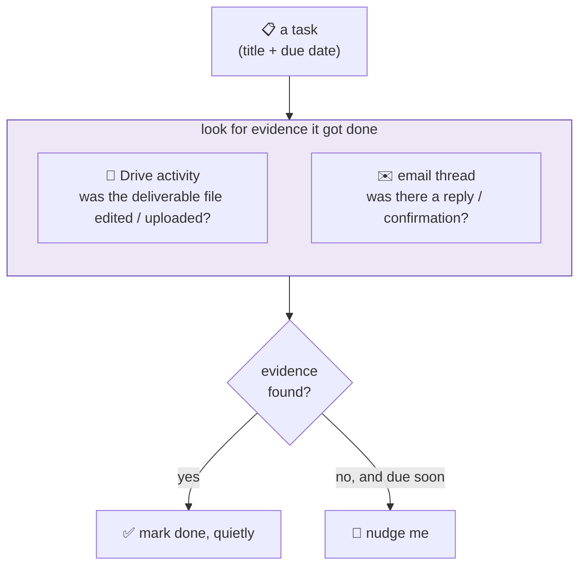

# 16 · The chief-of-staff: from "what's due" to "did you do it?"

The three lanes [brief me](06-the-schedule.md) on what's coming. But a brief that names a deadline and then forgets about it is just a louder calendar. The newest layer is a **chief-of-staff**: it pulls tasks out of the firehose, then actually checks whether each one *got done*, and only nudges me on the ones that didn't. It runs on the **MBA** and **family** lanes, off the same engine.

> **It tracks follow-through, not just deadlines.** The hard part isn't listing what's due, it's noticing what quietly *didn't* happen.

## Where the tasks come from

A cheap model turns messy inputs into structured tasks (a title, a due date, which lane owns it), and de-duplicates so the same deadline arriving in two emails doesn't become two tasks.

| Lane | Task sources |
|------|--------------|
| 🎓 **MBA** | course deliverables (from the Drive coursework scan) + Wharton email ("submit the case by Thursday") |
| 👨‍👩‍👧 **Family** | school emails + relocation to-dos |

## The part that's actually different: looking for evidence

Most reminder apps make *you* tick the box. This one goes looking for proof that the thing happened.



- **Drive activity:** if the deliverable's file shows edits or an upload around its due date, that's strong evidence it's handled.
- **An email thread:** a reply or confirmation on the relevant thread counts too.
- **Otherwise** it stays open, and the nudge gets more insistent as the deadline approaches.

## A task's life

```
extracted ──▶ open ──▶ (evidence found)  ──▶ ✅ done, no ping
                  └──▶ (deadline near,   ──▶ 📱 "did you finish X?"
                        no evidence)
```

A daily **📋 TASKS** block lands in the lane's push. I can also close anything by hand, just reply `done: <task>`. And tasks that linger forever get capped and closed so the list doesn't slowly rot into noise.

## The guardrails

- **Evidence is a heuristic, not proof.** Editing the wrong file, or a confirmation that never got emailed, can fool it, so I can always correct it, and "did you finish X?" is phrased as a question, not an accusation.
- **One engine, two lanes.** The task ledger is lane-agnostic; the MBA and family lanes plug in their own sources behind the same interface. Same code, well tested, two very different jobs.
- **It proposes, I confirm.** Like everywhere else in the fleet, the agent surfaces; the human decides what's really done.

This is the natural next step after the [schedule](06-the-schedule.md) and the [design principles](05-design-principles.md): not just *"here's what's coming"*, but *"here's what's slipping."*

---
**Back to:** [README](../README.md) · [The schedule](06-the-schedule.md) · [Design principles](05-design-principles.md) · [The fleet map](08-the-fleet-map.md)
