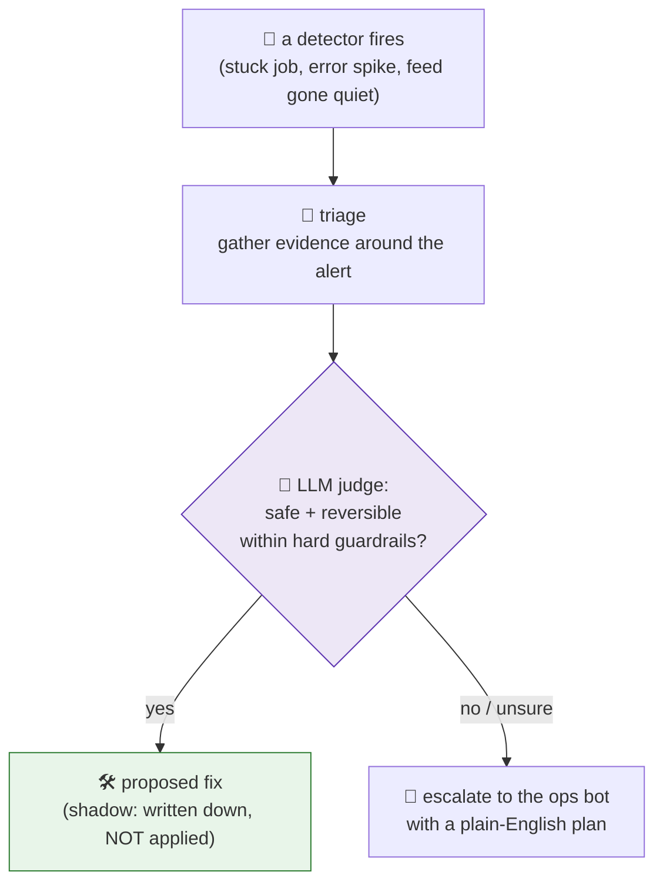

# 17 · The fleet that fixes itself (carefully)

The [ops lane](09-the-ops-lane.md) is the fleet that watches the fleet. The obvious next question: when something breaks, can it **fix** itself without paging me? The answer is *yes, but only the safe, reversible things* — and, deliberately, it mostly still **proposes** rather than acts.

> **It runs in shadow mode.** For now it writes down exactly what it *would* do, and applies nothing, until it has earned the right to act. Earning that right is the whole design problem.

## Two layers of self-repair

1. **A self-healing watchdog** (runs hourly) clears *known, boring* failure modes on its own, a job that got wedged, a connection that needs a kick.
2. **A remediation agent** reads the detectors' alerts, gathers evidence, and an LLM judges each one: is this inside a small set of safe, reversible fixes, or does it need a human? Safe ones become proposed fixes; everything else escalates with a written plan.

## Why shadow-first, on purpose

An agent that can *change your running systems* is exactly the kind you don't hand the keys to on day one.

- **The applier is built and dry-run tested, but deliberately not wired** to act autonomously yet. It produces a "here's the fix I'd apply" file; a human still pulls the trigger.
- **A kill-switch** disables the entire thing instantly (one file, and it stands down).
- **Restarts always ask first.** Anything that bounces a service or edits config is propose-don't-execute, the same rule as the [AI PM](14-the-ai-pm.md).
- **A daily ops digest** recaps what it saw and what it would have done, so the shadow record is visible, not buried.

## The guardrails

- **Hard fence:** only a known-safe, reversible set is ever even *eligible* for auto-fix. Novel problems escalate by default.
- **Noise discipline:** a durable incident ledger, with reconnect blips and approval prompts filtered out so they don't masquerade as outages (an early version cried wolf; that got fixed).
- **Human-in-the-loop** for anything that restarts a service or rewrites configuration, always.

The honest summary: it's built to be *cautious to a fault*. The interesting work here isn't getting an AI to fix things, it's designing the trust ladder it has to climb before it's allowed to.

---
**Back to:** [README](../README.md) · [The ops lane](09-the-ops-lane.md) · [Design principles](05-design-principles.md) · [When it goes wrong](11-when-it-goes-wrong.md)
