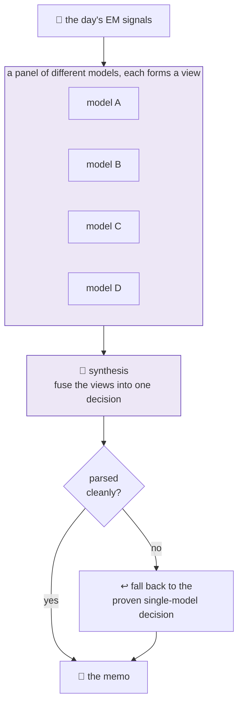

# 18 · Many minds, one call: getting several AIs to vote

The [AI PM](14-the-ai-pm.md) uses **one** flagship model to deliberate over the day's signals. A newer experiment asks a different question: what if **several** different models each form a view, and then we fuse those views into a single decision? In the literature this is called a *mixture-of-agents*; here it's a third "engine" the PM can run.

> **Several models propose; one synthesis decides, and if the panel gets confused, it quietly falls back to the trusted single model.** A decision always ships.

## The shape

## Why bother at all

- Different models have different blind spots and habits. A panel can be **steadier** than any single one having an off day.
- But it isn't free: more models means more cost, and more ways to fail (one model returns garbage, or wraps its answer in formatting that breaks the parser).

## How it's kept safe and cheap

Same discipline as the rest of the fleet ([design principles](05-design-principles.md)):

- **It's gated.** It only fires on verified signals, at most once a day.
- **It's an A/B canary**, running *alongside* the proven single-model engine, not replacing it.
- **It auto-falls-back.** If the fused output can't be parsed cleanly, the PM uses the single-model decision instead, so a confused panel never means a missed memo.
- **It's cheap per run** — a couple of cents.

## The honest state

- **This is a trial, not a verdict.** It is *not* yet proven to beat one good model.
- **Early on it fell back a lot.** The panel kept wrapping its answers in formatting (code fences, preambles) that the parser choked on; the fix was a more forgiving parser plus a wider panel. Every one of those fall-back days still shipped a valid decision, which is exactly why the fallback exists.
- **The open question** is the whole point: does a panel of models actually produce better calls than a single strong one, cheaply enough to justify the extra moving parts? That's what the A/B is for.

---
**Back to:** [README](../README.md) · [The AI PM](14-the-ai-pm.md) · [Design principles](05-design-principles.md) · [Architecture](02-architecture.md)
