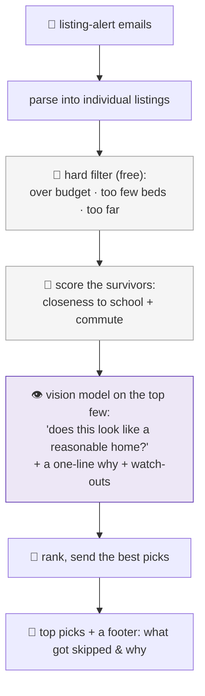

# 19 · The family lane learns to see: AI that judges a house photo

Almost everything in this fleet reads **text**. The [family lane](../README.md) recently learned to do something different for our house hunt: it **looks at the pictures**. We're relocating, and rental listings arrive by email all day. Instead of forwarding every one, the agent filters them, ranks them, and, crucially, judges whether each place actually *looks reasonable*.

> **It doesn't just keyword-match a listing, a vision model looks at the photo** and asks "is this a presentable family home, or run-down / the wrong kind of place?"

## The pipeline, cheap-first as always

- **Deterministic filters first (free).** Drop anything over a rent ceiling, below a minimum bed/bath count, or too far from the kids' school and a train line. Most listings die here, for nothing.
- **Score what's left** on what actually matters to us, balancing closeness to school against commute.
- **Then the only paid step:** a vision model looks at the *top few* photos, rates how reasonable the place looks, and writes a one-line reason plus any watch-outs.
- **Send the best, ranked,** each with a fit score, and a footer that says what got skipped and why.

## Why this shape

- **Cost discipline, again.** Cheap filters do ~85% of the work; the vision model is spent only on the finalists, and capped per run. The whole thing costs pennies a month.
- **Graceful-degrade.** If the vision call fails, it still ranks on the deterministic score, so a flaky model never means a missed listing.
- **It has a cousin.** The relocation scanner uses a cheap model as a *relevance gate*: is this a real, personalized housing/flight email, or marketing? It fails *open*, when unsure, it shows me rather than risk hiding something that matters.

## The honest part

- **"Looks reasonable" is a judgment, and will sometimes be wrong.** It ranks; I decide which to actually chase.
- **The footer is the trust signal.** Telling me *what it skipped and why* ("8 over budget, 2 too small, 1 too far") is how I know it isn't quietly burying a good one. An agent that filters without showing its cuts is an agent you stop trusting.

This is the same philosophy as [memory](04-memory.md) and the [design principles](05-design-principles.md), pointed at pixels instead of prose: do the cheap thing first, spend the smart model only where judgment is actually needed, and always show your work.

---
**Back to:** [README](../README.md) · [Design principles](05-design-principles.md) · [Memory](04-memory.md) · [The schedule](06-the-schedule.md)
