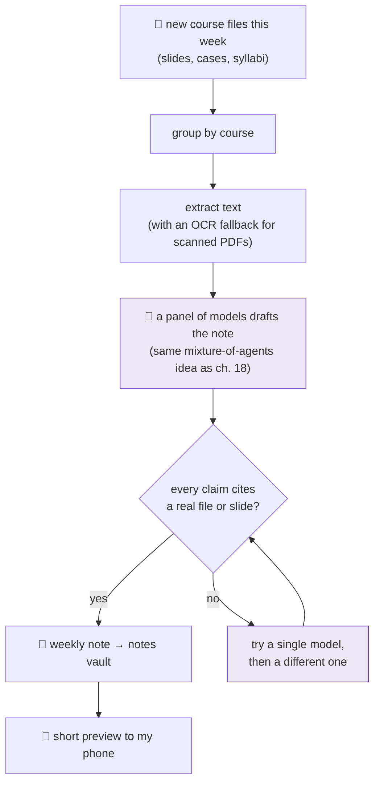

# 20 · The study companion: from a folder of slides to a finished degree

The MBA lane started as a deadline nagger ([the schedule](06-the-schedule.md)) and a note taker ([cross-episode synthesis](15-cross-episode-synthesis.md)). This year it grew into something closer to a study partner: it reads what the professors post, writes weekly notes worth rereading, notices when a course *ends*, and helps build the final deliverable.

> **Files land in a folder; the agent turns them into notes, calendar entries, and eventually a capstone, without being asked.**

## The weekly loop

Every Sunday, the agent walks the week's new course files and writes one synthesis note per course:

Three details do most of the work:

- **Citations are enforced, not requested.** A validator rejects any note where a bullet does not point at a real filename or slide number. A note that fails validation is retried on a different model. Uncited synthesis is how hallucinations sneak into your exam prep.
- **The panel writes deeper notes than one model.** The same mixture-of-agents pattern from [chapter 18](18-many-minds-one-call.md), pointed at coursework instead of markets: several budget models each read the material, a judge fuses their takes. Cost went from about a cent a week to about a dollar. Worth it.
- **Scanned PDFs stopped disappearing.** Some professors post image-only PDFs. Text extraction used to return nothing and the whole course got silently skipped that week. Now a local OCR pass rescues them, and the log says which extractor won.

## The agent reads the syllabus too

Each course folder usually contains a syllabus. The agent distills it once (objectives, deliverables, due dates, what the professor says they grade) and injects that into every weekly note, so the synthesis points *toward the exam and the deliverables* instead of just summarizing slides.

That distillation is also how the agent discovered, on its own, that one course ends with a personal application project. Every weekly note for that course now ends with two or three "seeds": concrete ways to apply that week's concepts at work. When the course wraps up, the accumulated seeds become the first draft of the final deliverable. I edit; it never submits anything.

## Courses end. The agent notices.

A small ledger tracks each course's pulse. When a course goes quiet past its syllabus end date, the agent:

1. marks it finished (no more weekly attempts, no ghost reminders),
2. writes a **capstone**: one document distilling the whole course, cross-week themes, the handful of concepts worth keeping for life, and where each one applies in my actual job,
3. sends me the link and goes quiet.

The first two capstones (an entrepreneurship course and a study trip) wrote themselves the day this shipped.

## And the calendar takes care of itself

The same deadline data now flows into Google Calendar daily: every assignment and class session becomes an event with reminders, deduplicated against anything already there (including events I made by hand). Two honest lessons from the first week:

- **Course documents lie.** Two official files disagreed on a case deadline by two days. The sync keeps the earlier date and notes the conflict in the event, better a duplicate warning than a missed deadline.
- **The LMS is the only truth.** A recycled syllabus template carried dates from a previous year, and a professor moved deadlines after posting. The pipeline now reconciles against the live LMS state and corrects calendar events when they drift. How it silently failed to do that for six days is [chapter 21](21-evals-as-tripwires.md).

## Why this matters beyond an MBA

Nothing here is course-specific. The pattern is: **watch a folder, enforce citations, respect a lifecycle, and turn accumulation into a deliverable.** Swap "course" for "client", "deal", or "project" and the same loop writes your weekly account notes and your end-of-engagement summary.

---

**Back to:** [README](../README.md) · **Related:** [06 The schedule](06-the-schedule.md) · [15 Cross-episode synthesis](15-cross-episode-synthesis.md) · [18 Many minds, one call](18-many-minds-one-call.md) · [21 Evals as tripwires](21-evals-as-tripwires.md)
