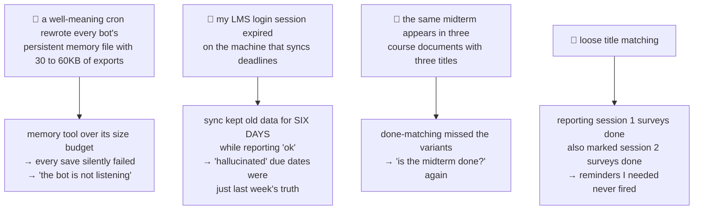
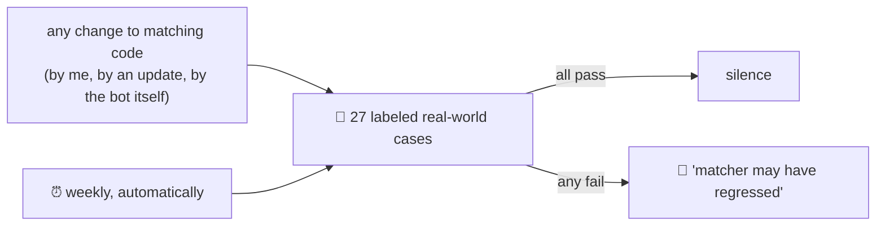

# 21 · Evals as tripwires: the day all four bots went quietly wrong

[Chapter 11](11-when-it-goes-wrong.md) collected early failures. This one is a single day, four bugs, and the lesson that finally stuck.

> **Agents fail silently. Exit codes lie. You have to wire the alarms yourself.**

## The symptoms (as I experienced them)

- The family bot stopped "listening": I would tell it a task was done, it would acknowledge, and next day it had forgotten.
- The MBA bot asked me whether a midterm was done. I had submitted it days earlier, and the bot even knew that.
- The same bot quoted a due date that was a week off. "Hallucination!", I typed, annoyed.

Three different symptoms. None of them was what it looked like.

## What was actually wrong

The theme: **not one of these threw an error.** Every pipeline exited zero. Every cron reported ok. The failures only existed in the gap between what the data said and what was true.

## The fixes worth stealing

**1. A bot's memory file belongs to the bot.** An exporter had been writing a daily digest into the exact file the bots use as persistent memory (which also feeds their system prompt). Everything the bots saved got clobbered daily, and the file blew past the memory tool's size budget so new saves failed too. The exporter now writes to its own file. If two systems write one file, one of them is corrupting the other; you just have not noticed yet.

**2. Silent staleness is the worst failure mode.** The deadline sync had a polite fallback: if the LMS session was expired, keep the old snapshot, note it quietly, exit clean. Reasonable for one missed night. Catastrophic for six, during a week a professor moved deadlines. The fallback now sends a loud daily "SYNC BROKEN, here is the one-minute fix" message until it is healthy. Fail-soft is for transient conditions; anything that can persist needs to escalate.

**3. Matching needs to understand *identity*, not just words.** "Midterm Exam (Lectures 1-5)" and "Midterm Exam" are the same thing. "Exit Ticket V" and "Exit Ticket VI" are not, and neither are "S2A" and "S2B". The matcher now strips cosmetic qualifiers before comparing, but treats numbers, roman numerals, and session codes as hard identity: if they conflict, no amount of word overlap makes a match. It fails in the safe direction, a duplicate question instead of a silently closed deadline.

## The part that makes it durable: a labeled eval

Every fix above came with a test case drawn from the real incident, added to a small labeled eval: real filenames, real email subjects, real title pairs, each labeled with the outcome ground truth implies.

It started at 16 cases; the incident above grew it to 27. It runs weekly on a schedule, silent when green, and pings my phone if anything fails. That last part matters more than the cases: agent fleets get modified by updates, by patches, and sometimes by the agents themselves ([chapter 17](17-the-fleet-that-fixes-itself.md)). A regression suite nobody runs is decoration.

## The honest takeaway

I did not find these bugs by reading code. I found them because I finally *noticed* the bots behaving oddly and said so, in plain words, to the assistant that maintains them. The debugging session that followed traced each symptom to evidence before touching anything. If your agent seems dumb, stale, or deaf: say exactly what you observed. The cause is usually three layers away from the symptom, and it is almost never "the model got worse".

---

**Back to:** [README](../README.md) · **Related:** [11 When it goes wrong](11-when-it-goes-wrong.md) · [17 The fleet that fixes itself](17-the-fleet-that-fixes-itself.md) · [20 The study companion](20-the-study-companion.md)
