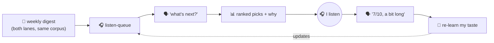
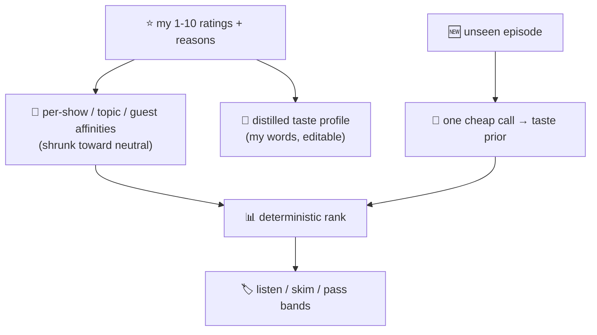

# 22 · The queue that learns my taste: podcasts, rated in my own words

[Chapter 03](03-the-digest-pipeline.md) turned 20 hours of podcasts into a 2-minute read, and [chapter 15](15-cross-episode-synthesis.md) tied those episodes into themes. Both had the same blind spot: they told me what each episode was *about*, then guessed whether I'd want it. The guess was bad, and this chapter is about teaching the fleet to stop guessing.

> **A recommendation that doesn't learn from you is just a stranger's opinion, repeated.**

## The thing that annoyed me

The weekly digest labeled every episode "listen" or "skim". Fine idea, weak execution:

- The label was a **one-shot guess** from the model, made fresh each week. It knew nothing about *my* taste, so the same episode could be "listen" one week and "skim" the next.
- It kept **re-recommending things I'd already heard**. No memory of what I'd done.
- It couldn't handle a **high-variance show**. Odd Lots is mostly not-for-me and then one hedge-fund episode is exactly for me. Per-show reputation can never catch that. Only judging the *episode's content against my actual taste* can.

Two concrete misses on the day I finally complained: an Odd Lots hedge-fund episode and Beyond the Pilot's "Routing Wars" were both flagged "skim". I wanted both.

## The fix: a queue I talk to, that learns from how I rate

One shared listen-queue now spans both the work and MBA lanes, and I manage it in plain language from **either** bot. Three things I can say:

- **"what's next?"** → a ranked up-next list, what I've recently finished, and the counts. No AI runs for this; it's a straight read, so it's instant and never drifts.
- **"listened to the Claire Vo episode, 7/10, a bit long"** → marks it done, stores the score *and my reason*, and re-learns.
- **"skip the X one"** → marks it skipped, a soft thumbs-down.

Every suggestion comes with a one-line *why* that says what it's leaning on and how much it has to go on ("you rate this show highly, 3 episodes in").

## How it learns (and why there's no AI in the ranking)

The old engine let a model *order* the list, and that's exactly what felt arbitrary. So the ranking is now **plain arithmetic on my own ratings**, deterministic, inspectable, same input always gives the same order:

- Each thing I rate teaches three axes: the **show**, the **topic**, and the **guest**. A 9/10 for a Matt Marshall episode nudges his name, his show, and its topic all upward.
- Small samples are pulled toward neutral (a Bayesian shrink), so one rating doesn't crown a whole show. Confidence grows only as the ratings do.
- New episodes I've never seen a signal for get a **cold-start prior**: one cheap model call at ingestion reads the episode and scores how well it matches my taste, so the queue isn't blank for anything novel.

Separately, the model distills a short, **human-readable taste profile from my written reasons**, not a prompt I hand-wrote, but a LIKES/DISLIKES summary built from what I actually said, each line citing the rating behind it. I can open and edit it. It's re-distilled every few new ratings, not every time, to keep it cheap.

## Where the learning leaks out (on purpose)

- **The digest's own labels got replaced.** That weak "listen/skim" verdict now comes from these personalized bands (listen / skim / pass), and episodes I've already rated show *my* score instead of a guess.
- **The rest of the fleet hears about it.** Each rating and reason is exported (fail-soft, never blocking the chat) to the shared memory service under a `podcast-taste` topic, so the morning briefs and [weekly reviews](../README.md) can pick up the same interests.
- **A high rating pulls its neighbours up.** Rate something an 8+ and the confirmation offers similar queued episodes, same show, guest, or topic, so a strong signal immediately does work.

## The honest takeaway

The upgrade wasn't a smarter model; it was **feedback with memory**. The previous version had a capable model guessing in a vacuum. This one has a dumb-but-honest ranker standing on a pile of my own verdicts, and it gets better every time I tell it what I thought, in one sentence, in the same chat where I told it I'd finished listening. The cheapest models in the fleet run this; the intelligence is in the loop, not the size of the brain.

---
**Next:** [23 · The fleet by the numbers →](23-the-fleet-by-the-numbers.md)

**Back to:** [README](../README.md) · **Related:** [03 The digest pipeline](03-the-digest-pipeline.md) · [15 Cross-episode synthesis](15-cross-episode-synthesis.md) · [04 Memory](04-memory.md)
