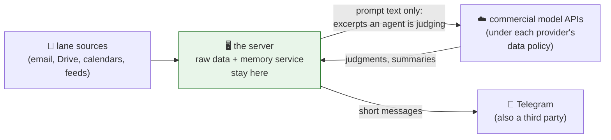

# 24 · What the agents can and cannot see

The [FAQ](12-faq.md) gives the honest one-liner: triaging email with an LLM means email text goes to a commercial AI provider, and you should make that trade-off deliberately. This page is the longer, structural answer: **exactly what data enters each lane, what never enters the system at all, where data lives, and what leaves the server.** If you're thinking of building a fleet like this, this is the page to copy the *thinking* from.

## What each lane is allowed to read

Each lane has its **own accounts, own credentials, own scopes**. No lane can read another lane's sources ([the boundary table in 04 · Memory](04-memory.md)).

| Lane | Reads | Notably does NOT read |
|------|-------|----------------------|
| 💼 Work | Public market/policy feeds (financial press, IMF, rating agencies, research preprints, podcasts) plus a **personal** email account that receives market newsletters and alerts | Any employer system, inbox, or document store |
| 🎓 MBA | My university email, the course Drive folders, the class calendar, and the university's learning platform | Anything outside the coursework accounts |
| 👨‍👩‍👧 Family | School and household email, the family calendar, rental-listing alerts for the move | Work or school content of any kind |
| 🛟 Ops | The other lanes' **job ledgers**: run status, errors, feed ages, service health | The other lanes' *content*: it can see that the brief ran, never what the brief said |

## What never enters the system, by design

This is the boundary I treat as non-negotiable, because I work in asset management:

- **No employer accounts or systems are connected.** The work lane's inputs are public sources and a personal account (that personal account is what other chapters casually call "the work inbox"). There is no employer inbox, no internal research, no position system, no client data anywhere in the fleet.
- **Nothing market-sensitive or non-public.** The work lane reads the same press, ratings actions, and IMF publications anyone can subscribe to.
- **The "AI PM" trades on paper only** ([14 · the AI PM](14-the-ai-pm.md)). It's a learning experiment with a memo as its only output. Nothing in the fleet can place, propose, or route a real order.
- **No autonomous outbound actions.** No agent sends email on my behalf, moves money, deletes data, or replies to anyone but me. The action model is propose-and-wait ([09 · the ops lane](09-the-ops-lane.md) draws the same line for infrastructure).

## Where data lives, and what leaves

- **Retained on the server:** raw fetched data, the memory service, brief archives, job ledgers. One machine, no third-party database.
- **Sent to model providers:** the text an agent is actively judging, which can include email excerpts. This is the FAQ's trade-off, made per lane: I accepted it for accounts I control, and the answer to "is my data training a model?" remains **check each provider's current policy**, not an assumption.
- **Sent to Telegram:** the final short messages. Telegram is also a third party; nothing secret goes in a ping.
- **Credentials:** live only on the server, per lane, and read-mostly (the calendar-sync job is the notable writer). The Telegram bots answer **only my account**: an allowlist, not obscurity.

## Publishing this repo without leaking

Everything public here went through the same scrub: real hosts, IPs, tokens, chat IDs, personal names, and account addresses replaced with placeholders; screenshots redacted before committing; a CI-checked repo with a [security policy](../SECURITY.md) for anything that slips through. The *architecture* is real; the coordinates are not.

## The one-table summary

| Question | Answer |
|----------|--------|
| Can the work agent see employer data? | No, none is connected |
| Can lanes read each other's sources? | No, separate accounts and scopes |
| Can ops read my content? | No, ledgers only |
| Does raw data leave the server? | Only the excerpts being judged, to model APIs, under their policies |
| Can any agent act on the world? | Message me, write its own files, and sync a calendar; everything else is propose-and-wait |
| Can the AI PM trade? | Paper only, structurally |

---
**Next:** [01 · What is an agent? →](01-what-is-an-agent.md) (back to the start)

**Back to:** [README](../README.md) · [Memory](04-memory.md) · [FAQ](12-faq.md) · [The fleet by the numbers](23-the-fleet-by-the-numbers.md)
